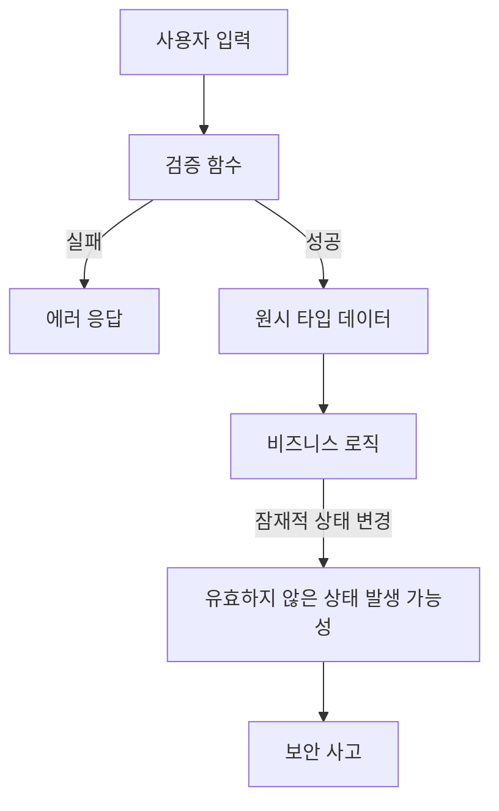
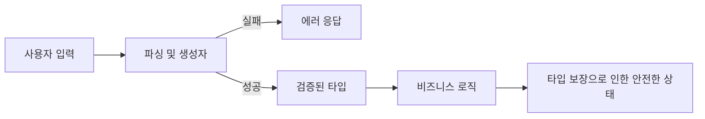

## 서론

보안 엔지니어로서 우리는 흔히 "가장 취약한 고리"를 찾아내려 노력합니다. 방화벽 설정, WAF 룰, 그리고 수많은 `if` 문으로 둘러싸인 런타임 검증 로직들이 바로 그 고리들입니다. 하지만 아무리 방화벽이 튼튼해도 내부 서버가 잘못된 상태로 인해 뻗어버린다면, 그건 서비스 거부(DoS) 공격이 성공한 것과 다름없습니다.

최근 금융권 핀테크 서비스의 취약점 분석 중, 흥미로운 사례를 발견했습니다. 개발자는 "할인율"이 항상 0보다 커야 한다는 불변식(Invariant)을 믿고 코드를 작성했지만, 어느 날 갑자기 마이너스 할인율이 적용되어 결제 금액이 0원이 되는 심각한 로직 결함이 발생했습니다. 원인을 추적해 보니, 할인율을 계산하는 비즈니스 로직 깊숙한 곳에서 런타임 검증을 한 줄 빼먹었던 것이 화근이었습니다. 즉, **"잘못된 상태가 시스템 내부에 존재할 수 있다"**는 가정 자체가 보안상 허점이었습니다.

이 글에서는 단순히 런타임에 에러를 잡아내는 것을 넘어, Rust의 강력한 타입 시스템을 활용해 **"잘못된 상태 자체를 컴파일 타임에 원천 봉쇄"**하는 Type-Driven Design(TDD) 방법론을 다룹니다. "검증(Validate)하지 말고 파싱(Parse)하라"는 철학을 통해 어떻게 보안에 견고한 시스템을 설계할 수 있는지 살펴보겠습니다.

## 본론

### 런타임 검증의 함정과 타입 시스템의 해법

전통적인 보안 코딩에서는 데이터가 들어오는 지점(Entry Point)에서 검증을 수행합니다. 하지만 데이터가 시스템을 통과하는 동안, 그 검증된 상태가 유지될지 보장할 수 없을까요? 잦은 타입 변환, 가변 상태(mutable state)의 변경, 혹은 개발자의 실수로 인해 이미 검증된 데이터가 다시 '유효하지 않은 상태(Invalid State)'로 훼손될 위험은 언제나 존재합니다.

Rust의 **Type-Driven Design**은 이 문제를 근본적으로 해결합니다. `NonZeroF32`나 `NonEmptyVec` 같은 **Newtype 패턴**을 사용하여, "빈 벡터"나 "0"이라는 값 자체를 타입 수준에서 표현 불가능하게 만드는 것입니다. 이는 단순한 편의 기능이 아니라, 공격자가 시스템의 로직을 교란하려 할 때 발생할 수 있는 Side Channel이나 Logic Bug를 차단하는 강력한 보안 메커니즘입니다.

### 데이터 흐름 비교: 검증 vs 파싱

기존의 런타임 검증 방식과 타입 주도 설계 방식의 데이터 처리 흐름을 비교해 보겠습니다.



위 다이어그램은 일반적인 검증 방식입니다. 검증을 통과했다고 해도 그 뒤의 로직에서 데이터가 오염될 가능성이 열려 있습니다. 반면, 타입 주도 설계는 다릅니다.



여기서 중요한 점은 `검증된 타입(D)`이 시스템 내부를 순회하는 동안 절대 "유효하지 않은 상태"가 될 수 없다는 컴파일러의 보장을 받는다는 것입니다.

### 실전 구현: Newtype 패턴과 PoC

**⚠️ 윤리적 경고**: 아래 예제 코드는 취약점을 이해하고 방어하는 학습 목적으로 작성되었습니다. 악의적인 목적으로 사용하는 것은 엄격히 금지됩니다.

가장 흔한 취약점 시나리오인 **"0으로 나누기(Division by Zero)"** 혹은 **"잘못된 ID로 인한 권한 상승"**을 방어하기 위해, Rust 표준 라이브러리의 `NonZero` 타입을 활용한 PoC 코드를 작성해 보겠습니다.

#### 취약한 코드 예시 (기존 방식)

```rust
// 보안 취약점: 런타임 검증만 의존
fn calculate_discount(price: f32, rate: f32) -> f32 {
    // 개발자가 실수로 검증 로직을 누락하거나, 
    // 다른 곳에서 rate가 0으로 조작되는 시나리오 상정
    if rate == 0.0 {
        panic!("Discount rate cannot be zero!"); // 런타임 패닉 -> DoS 가능성
    }
    price * (1.0 - rate)
}

fn main() {
    let user_input_rate = 0.0; // 공격자가 0을 주입
    // 검증 로직이 여기서 누락될 수 있음
    let final_price = calculate_discount(10000.0, user_input_rate); 
}
```

이 코드는 `rate`가 0이 들어오면 런타임에 패닉을 일으키거나, 혹은 검증을 건너뛰면 논리적 오류를 일으킵니다. 이는 공격자에게 시스템을 교란할 틈을 줍니다.

#### 안전한 코드 예시 (Type-Driven Design)

이제 `std::num::NonZeroF32`를 사용하여 **"0이 아닌 값"만 존재할 수 있는 타입**을 만들어 보겠습니다.

```rust
use std::num::NonZeroF32;

// Newtype 패턴: 유효한 할인율만 담을 수 있는 래퍼
#[derive(Debug, Clone, Copy)]
struct DiscountRate(NonZeroF32);

impl DiscountRate {
    // 생성자에서 검증을 수행하며, 실패 시 Option을 반환
    pub fn new(value: f32) -> Option<Self> {
        // 0.0이 아니면 성공, 아니면 None
        NonZeroF32::new(value).map(DiscountRate)
    }
    
    pub fn value(&self) -> f32 {
        self.0.get()
    }
}

// 이제 이 함수는 f32가 아닌 DiscountRate만 받음
// 따라서 내부에서 rate가 0인지 체크할 필요가 없음 (컴파일러 보장)
fn calculate_secure_discount(price: f32, rate: DiscountRate) -> f32 {
    // rate는 절대 0이 될 수 없으므로 안전함
    price * (1.0 - rate.value())
}

fn main() {
    let input = 0.1; // 사용자 입력
    
    // 입력값을 파싱하여 안전한 타입으로 변환 (Parse, don't Validate)
    match DiscountRate::new(input) {
        Some(valid_rate) => {
            let result = calculate_secure_discount(10000.0, valid_rate);
            println!("Calculated Price: {}", result);
        },
        None => {
            eprintln!("Error: Invalid discount rate provided!"); 
            // 실패 시 조기에 차단
        }
    }
    
    // 아래 코드는 컴파일 에러 발생!
    // calculate_secure_discount(10000.0, DiscountRate(0.0)); // 불가능
}
```

이 코드에서 `DiscountRate` 타입을 생성하는 유일한 방법은 `new` 메서드를 통하는 것입니다. 한번 생성되면, 그 내부의 값은 수학적으로 0이 될 수 없습니다. 즉, `calculate_secure_discount` 함수 내부에서는 **0에 대한 방어 코드가 전혀 필요 없으며, 공격자가 0을 주입하여 로직을 깨는 것은 물리적으로 불가능**해집니다.

### 런타임 검증 vs 컴파일 타임 보장

두 접근 방식의 보안적 특징을 비교한 표는 다음과 같습니다.

| 비교 항목 | 런타임 검증 (Runtime Validation) | 타입 주도 설계 (Type-Driven Design) |
| :--- | :--- | :--- |
| **보장 시점** | 실행 중 (Runtime) | 컴파일 타임 (Compile-time) |
| **실패 비용** | 서비스 중단 (Panic), 논리 오류 발생 가능 | 컴파일 에러 (실행 파일 생성 불가) |
| **상태 공간** | 유효하지 않은 상태가 메모리에 존재 가능 | 유효하지 않은 상태를 표현할 수 없음 |
| **공격 노출면** | 검증 로직 누락 시 로직 버그 야기 | 타입 시스템에 의해 자동 방어 |
| **유지보수성** | 검증 로직이 전 코드에 흩어짐 (Spaghetti Code) | 검증 로직이 생성자에 캡슐화됨 |

### 실무 적용 가이드: Step-by-Step

보안이 중요한 Rust 프로젝트에서 타입 주도 설계를 적용하는 단계별 가이드입니다.

1.  **불변식 식별 (Identify Invariants)**     *   코드베이스에서 반복적으로 등장하는 `if x != null`, `if !vec.is_empty()` 같은 검사 패턴을 찾으세요. 이것이 바로 불변식 후보입니다.

2.  **Newtype 정의 (Define Wrapper)**     *   `struct NonEmptyVec(Vec<T>)`와 같이 기본 타입을 감싸는 새로운 구조체를 정의하세요.     *   필드를 비공개(`private`)로 설정하여, 외부에서 직접 내부 값을 조작하지 못하게 막아야 합니다.

3.  **안전한 생성자 구현 (Safe Constructor)**     *   `new()` 또는 `try_from()` 같은 생성자를 구현하고, 여기서 **검증 로직을 단 한 번만** 수행하세요.     *   검증에 실패하면 `Option`이나 `Result`를 반환하여 에러를 명시적으로 처리하도록 강제합니다.

4.  **기능 위임 (Deref)**     *   필요하다면 `std::ops::Deref` 트레이트를 구현하여, 내부 타입의 메서드를 편리하게 사용할 수 있게 하세요. 단, 내부 값 수정(Mutability)은 주의해야 합니다.

5.  **Serde 통합 (Serialization)**     *   외부 JSON 파싱 등에서도 이 타입을 사용하려면 `serde`의 `deserialize_with` 기능을 활용하여, 역직렬화 과정에서도 타입 검증이 자동으로 이루어지도록 설정하세요.

## 결론

지금까지 Rust의 타입 시스템을 활용하여 런타임 에러와 보안 취약점을 컴파일 타임에 차단하는 Type-Driven Design에 대해 알아보았습니다. 보안 전문가의 관점에서 볼 때, 이 접근 방식의 핵심은 **"신뢰할 수 있는 상태"**를 시스템의 기본 단위로 만든다는 점입니다.

`if` 문으로 쌓아 올린 성은 언제나 무너질 수 있습니다. 하지만 타입 시스템으로 만든 성은 컴파일러라는 거대한 감시자가 지키고 있습니다. 공격자가 아무리 교묘한 입력을 넣더라도, 컴파일된 바이너리 내부에는 "잘못된 상태"를 담을 그릇 자체가 존재하지 않으므로 안전합니다.

러스트를 사용하신다면, 단순히 `String`, `Vec`, `i32`에 의존하기보다 도메인의 불변식을 담는 **Newtype**을 적극적으로 도입해 보시길 권장합니다. 이는 코드의 가독성을 높일 뿐만 아니라, 예기치 못한 런타임 패닉과 논리적 보안 허점을 원천적으로 차단하는 가장 확실한 투자가 될 것입니다.

### 참고자료

- [Rust std::num::NonZero](https://doc.rust-lang.org/std/num/struct.NonZero.html)

- [Parse, don't validate (Alexis Beingessner)](https://lexi-lambda.github.io/blog/2019/11/05/parse-don-t-validate/)

- [The Rustonomicon: Unsafe Code Guidelines](https://doc.rust-lang.org/nomicon/)
