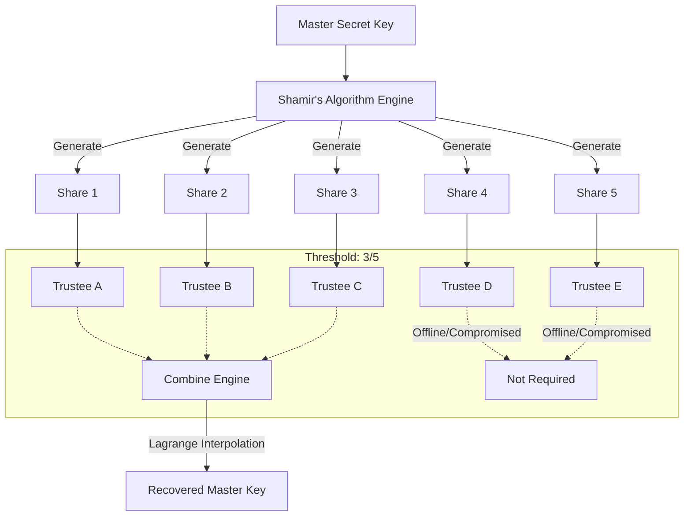

## 서론

데이터베이스의 관리자 비밀번호를 잃어버린 상황을 상상해 보십시오. 아니면, 하드웨어 월렛의 시드 구문(Seed Phrase)이 적힌 종이가 화재로 소실되었다고 가정해 봅시다. 이때 시스템에 저장된 수천만 개의 개인정보와 자산은 오직 당신의 머릿속에만 있는 비밀번호 때문에 영원히 잠겨버립니다. 이것은 단순한 불편함이 아니라, 운영상 재앙(Availability Breakdown)입니다.

반대로, 비밀번호를 잊어버리는 것을 방지하기 위해 비밀번호를 포스트잇에 적어 모니터 옆에 붙여두거나, USB 하나에 복사해서 책상 서랍 깊숙이 넣어두었다고 가정해 봅시다. 이번엔 보안 사고(Security Breach)의 위험입니다. 믿을 수 없는 cleaning staff나 침입자가 그 단 하나의 비밀 키를 훔친다면, 시스템 전체가 장악당합니다.

우리는 흔히 "보안"과 "편의(가용성)"는 반비례한다고 생각합니다. 하지만 암호학에는 이 두 가지를 동시에 만족시키는, 현장에서 즉시 사용할 수 있는 강력한 무기가 있습니다. 바로 **Shamir's Secret Sharing (SSS)**입니다. 이 글에서는 고전 암호학의 정수인 샤미어의 비밀 분할 알고리듬이 어떻게 현대의 키 관리(Key Management) 문제, 특히 '비밀 분산 저장'을 통해 '사회적 복구(Social Recovery)'를 가능하게 하는지 실무적인 관점에서 분석하겠습니다.

## 본론

### 기술적 원리: 다항식 보간법의 마법

샤미어의 비밀 공유 알고리즘은 1979년 Adi Shamir가 발표한 알고리즘으로, 수학적으로 완벽한 보안(Information-Theoretic Security)을 제공합니다. 그 원리는 놀랍도록 간단합니다. 비밀값(Secret)을 $n$차 방정식의 상수항($y절편$)으로 정의하고, 그 그래프 위의 점들을 분배하는 것입니다.

**⚠️ 윤리적 경고 (Ethical Warning)**

아래 설명되는 모든 기술과 코드는 오직 **방어 목적(Defensive Security)**과 시스템의 **가용성 복구(Availability Recovery)**를 위해서만 사용해야 합니다. 이 기술을 악용하여 타인의 자산을 탈취하거나 무단 접근을 시도하는 행위는 법적 처벌을 받을 수 있습니다.

예를 들어, 당신의 비밀 키가 $S$라고 합시다. 우리는 $S$를 상수항으로 갖는 $k-1$ 차 다항식 $f(x)$를 생성합니다. $$f(x) = S + a_1x + a_2x^2 + ... + a_{k-1}x^{k-1}$$

여기서 $k$는 **임계값(Threshold)**입니다. 만약 5명 중 3명이 모여야 키를 복구하고 싶다면, $k=3$인 2차 방정식을 만듭니다. 그리고 이 곡선 위의 점 $(x, y)$을 5개($n=5$) 생성하여 친구들에게 하나씩 나눠줍니다.

기하학적으로 생각하면 2차 방정식(포물선)은 **정확히 3개의 점**이 있어야 그 형태를 결정할 수 있습니다. 2개의 점만으로는 무수히 많은 포물선을 그릴 수 있으므로 비밀($S$)을 알 수 없습니다. 이것이 바로 **$k$개 미만의 조각으로는 정보의 1비트도 유출되지 않는다**는 원리입니다.

### 아키텍처: 분산 저장부터 복구까지

이 시나리오를 시스템 아키텍처 관점에서 시각화하면 다음과 같습니다. 단일 실패 지점(SPOF)을 제거하고, 신뢰 계층을 분산하는 구조입니다.



이 다이어그램은 실제 운영 환경에서의 흐름을 보여줍니다. Trustee D나 E가 연락이 되지 않거나 타협당했더라도, A, B, C만 안전하면 시스템은 복구됩니다. 이는 **"단일 신뢰 포인트(Trusted Party)가 없는 암호화 시스템"**을 구축하는 핵심입니다.

### 전략 비교: 왜 샤미어인가?

단순히 파일을 압축해서 암호를 나누거나, XOR 연산으로 쪼개는 방법도 있지만, 샤미어 방식이 가지는 이점은 명확합니다. 특히 Key Recovery 시나리오에서의 효율성은 압도적입니다.

| 비교 항목 | 단순 분할 (XOR/Bitwise) | Shamir's Secret Sharing (SSS) |
| :--- | :--- | :--- |
| **보안성** | 일부 조각이 유출되면 정보가 일부 노출될 수 있음 | $k-1$개의 조각으로는 **전혀 정보가 유출되지 않음** |
| **유연성** | 분할한 모든 조각이 필요 ($n/n$) | $n$개 중 $k$개만 모으면 복구 가능 ($k/n$) |
| **확장성** | 조각을 추가하려면 처음부터 다시 분배해야 함 | 수학적으로 새로운 조각을 쉽게 생성 및 추가 가능 |
| **키 관리** | 관리자가 모든 조각을 합치려면 전체 필요 | 손실된 조각이 있어도 지정된 인원만 모으면 됨 |

### 실전 적용: Step-by-Step 가이드

현장에서 바로 적용할 수 있는 파이썬 기반의 PoC(Proof of Concept)를 작성해 보겠습니다. 이 코드는 학습 및 테스트 목적으로 사용하며, 실제 운영 환경에서는 검증된 라이브러리(예: HashiCorp Vault의 Shamir 지원, `soss` 등)를 사용하십시오.

#### 1. PoC 코드 구현 (Python)

이 코드는 `secrets` 모듈을 사용하여 랜덤 계수를 생성하고, 라그랑주 보간법(Lagrange Interpolation)을 통해 상수항(비밀)을 복구합니다.

```python
import random
from functools import reduce

# 유틸리티: 모듈러 연산을 위한 역원 계산 (Extended Euclidean Algorithm)
def _extended_gcd(a, b):
    x0, x1, y0, y1 = 1, 0, 0, 1
    while b:
        q, a, b = a // b, b, a % b
        x0, x1 = x1, x0 - q * x1
        y0, y1 = y1, y0 - q * y1
    return a, x0, y0

def modinv(a, m):
    g, x, y = _extended_gcd(a, m)
    if g != 1:
        raise Exception('Modular inverse does not exist')
    return x % m

# 1. 다항식 생성 및 분할 (Split)
def split_secret(secret, total_shares, threshold, prime=2**127-1):
    """
    secret: 복구하려는 비밀 정수
    total_shares: 총 생성할 조각 수 (n)
    threshold: 복구에 필요한 최소 조각 수 (k)
    prime: 큰 소수 (Finite Field)
    """
    if threshold > total_shares:
        raise ValueError("Threshold cannot be greater than total shares")

    # 다항식 계수 생성: coeff[0] = secret
    coeff = [secret] + [random.randint(0, prime - 1) for _ in range(threshold - 1)]

    shares = []
    for i in range(1, total_shares + 1):
        x = i
        # f(x) 계산
        y = 0
        for j in range(len(coeff)):
            y += coeff[j] * (x ** j)
        y %= prime
        shares.append((x, y))

    return shares

# 2. 라그랑주 보간법을 통한 복구 (Combine)
def recover_secret(shares, prime=2**127-1):
    """
    shares: [(x1, y1), (x2, y2), ...] 최소 threshold개 이상
    """
    if len(shares) < 2:
        raise ValueError("Not enough shares to recover")

    # 라그랑주 보간법 공식
    # L(0) = sum(y_i * l_i(0))
    def lagrange_interpolate(x, x_s, y_s):
        k = len(x_s)
        result = 0
        for i in range(k):
            numerator, denominator = 1, 1
            for j in range(k):
                if i != j:
                    numerator = (numerator * (x - x_s[j])) % prime
                    denominator = (denominator * (x_s[i] - x_s[j])) % prime
            # L_i(0) = term
            term = (y_s[i] * numerator * modinv(denominator, prime)) % prime
            result = (result + term) % prime
        return result


    x_s = [s[0] for s in shares]
    y_s = [s[1] for s in shares]

    return lagrange_interpolate(0, x_s, y_s)

# --- 실행 예시 ---
if __name__ == "__main__":
    # 시나리오: 비밀 키 (예: 123456789)
    MY_SECRET_KEY = 123456789

    print(f"1. 원본 비밀 키: {MY_SECRET_KEY}")

    # 설정: 5명에게 나눠주고, 3명만 모으면 복구 가능 (3, 5)
    SHARES = split_secret(MY_SECRET_KEY, total_shares=5, threshold=3)
    print(f"2. 생성된 조각들 (Shares):")
    for idx, share in enumerate(SHARES):
        print(f"   Friend {idx+1}: {share}")

    # 공격 시뮬레이션: 친구 2명만 모임 (실패해야 함)
    # recover_secret(SHARES[:2])를 하면 복구 불가능하거나 엉뚱한 값이 나옴

    # 복구 시뮬레이션: 친구 1, 3, 5가 모임 (성공해야 함)
    subset_shares = [SHARES[0], SHARES[2], SHARES[4]]
    recovered_key = recover_secret(subset_shares)

    print(f"3. 복구된 비밀 키: {recovered_key}")
    print(f"4. 복구 성공 여부: {'✅ SUCCESS' if recovered_key == MY_SECRET_KEY else '❌ FAIL'}")
```

#### 2. 현장 적용 시나리오

이제 이 로직을 실제 보안 설계에 적용하는 방법입니다.

1. **준비 (Setup)**: 관리자는 오프라인 환경(폐쇄망)의 안전한 머신에서 위 스크립트나 CLI 툴(`ssss`)을 사용해 마스터 키를 $n$개로 쪼갭니다.
2. **분배 (Distribute)**:
    *   친구 A에게는 조각 1 (USB 저장)
    *   친구 B에게는 조각 2 (종이 출력물)
    *   친구 C에게는 QR 코드 암호화된 조각 3 전송
    *   ...
3. **비상 상황 (Incident Response)**: 당신이 사고를 당하거나 비밀번호를 잊었습니다.
4. **복구 (Recovery)**: 친구 3명에게 연락하여 조각을 전달받습니다.
5. **재조립 (Combine)**: 복구 툴에 3개의 조각을 입력하여 마스터 키를 복구하고 시스템을 잠금 해제합니다.

### 방어 가이드 및 완화 조치

Shamir's Secret Sharing을 도입할 때 고려해야 할 보안 통제 사항입니다.

**1. 즉시 조치 (Implementation)**

- **안전한 소수(Prime) 사용**: 필드의 크기를 결정하는 소수는 충분히 커야 하며(최소 128비트 이상 권장), 예측 가능해서는 안 됩니다.

- **조각 보안**: 조각 자체도 민감 정보입니다. 조각을 전송할 때는 별도의 암호화(E2E)를 적용하거나, 물리적 전달을 고려해야 합니다.

**2. 거버넌스 및 프로세스 (Governance)**

- **Trustee 선정**: 조각을 받을 사람(Trustee)은 신원이 확인되어야 하며, 사회공학적 해킹(Social Engineering)에 대한 방어 교육을 받아야 합니다.

- **주기적인 재갱신 (Key Rotation)**: 총 조각 중 일부가 유출되었다고 의심되거나 주기적으로(예: 1년마다) 마스터 키를 변경하고 새로운 조각을 재분배해야 합니다. 이를 **Proactive Secret Sharing**이라고 합니다.

## 결론

Shamir's Secret Sharing은 "신뢰"라는 모호한 개념을 수학적으로 분할하여 관리하는 탁월한 기술입니다. 단일 지점 장애(SPOF)를 제거함으로써, 시스템 관리자가 실수하거나 사고를 당했을 때의 가용성 위험을 해결하면서도, 동시에 권한이 없는 제3자의 접근을 원천적으로 차단하는 보안성을 확보합니다.

이 기술의 진정한 가치는 암호학 수식 그 자체보다는 **인적 요인(Human Factor)**을 보안 설계에 통합했다는 점에 있습니다. 나의 비밀을 나만 지키는 것이 아니라, 신뢰할 수 있는 집단의 책임감과 수학적 안전성을 결합한 **사회적 복구 메커니즘**은 탈중앙화 시대의 필수적인 키 관리 전략이 될 것입니다.

암호화폐 지갑 복구부터, 시스템 관리자 계정의 이중/삼중 제어 escrow 계정까지, SSS를 도입하여 여러분의 자산과 시스템이 "단일 실수"로 붕괴되지 않도록 탄탄하게 방어하시기 바랍니다.

### 참고자료

- [How to Share a Secret, Adi Shamir (1979)](https://dl.acm.org/doi/10.1145/359168.359176)

- [ssss - Simple Secret Sharing Scheme (Linux Man Page)](https://linux.die.net/man/1/ssss)

- [HashiCorp Vault - Shamir Keys](https://www.vaultproject.io/docs/concepts/shamir)
