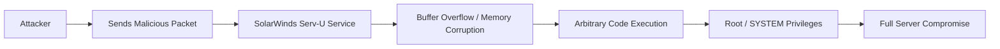

## 서론

새벽 2시, SOC (Security Operation Center) 모니터링 담당자의 화면을 빨간 불이 비춥니다. 방화벽 로그에는 내부에서 외부로 향하는 대용량의 트래픽이 발생하고 있었고, 그 출발지는 바로 관리자가 믿고 있던 파일 전송 서버(File Transfer Server)였습니다. 이 서버는 겉으로보기에는 아무런 이상 없이 정상적으로 작동하고 있었습니다. 하지만 내부적으로는 공격자가 이미 서버의 최고 권한인 Root를 장악한 뒤, 마음껏 데이터를 유출하고 있던 상황이었습니다.

SolarWinds Serv-U는 전 세계적으로 수많은 기업에서 사용되는 인기 있는 파일 전송 솔루션입니다. 하지만 최근 발표된 취약점은 이러한 신뢰를 한순간에 무너뜨릴 수 있는 수준입니다. 이번에 분석할 취약점의 핵심은 단순한 정보 노출이나 서비스 거부(DoS)가 아닙니다. 바로 **인증 과정 없이 원격에서 서버의 Root 권한을 탈취할 수 있는 Remote Code Execution (RCE)** 취약점입니다.

공격자는 복잡한 사회공학 기법을 쓰지 않아도, 그리고 내부 네트워크에 침투하기 위한 긴 터널링 과정을 거치지 않아도 됩니다. 단지 Serv-U 서비스가 열어둔 포트로 특수하게 조작된 패킷을 보내는 것만으로, 해당 서버가 실행된 시스템 전체의 지배권을 뺏을 수 있습니다. 이는 보안 업계에서 "The Holy Grail(성배)"라고 불리는 공격 시나리오 중 하나입니다. 왜 이 취약점이 그토록 위험한지, 그리고 어떤 원리로 작동하는지 현장 감각 있는 분석을 통해 살펴보겠습니다.

*(⚠️ **윤리적 경고**: 본 문서에 포함된 모든 기술적 정보와 코드는 보안 연구 및 방어 목적이며, 허가되지 않은 시스템에 대한 테스트는 불법입니다.)*

## 본론

### 취약점의 기술적 메커니즘

SolarWinds Serv-U 취약점은 주로 SSH 또는 FTP 프로토콜 핸들러의 특정 메모리 처리 루틴에서 발생합니다. 공격자는 클라이언트 역할을 하여 서버에 연결을 시도하는 과정에서, 버퍼의 경계를 검증하지 않는 결함(Buffer Overflow 혹은 Type Confusion)을 악용합니다.

이 취약점의 가장 치명적인 점은 Serv-U 데몬(Daemon)이 보통 높은 권한(Windows의 SYSTEM 또는 Linux의 root)으로 실행되도록 설정된다는 사실입니다. 파일 서버는 포트 22(SSH)나 21(FTP)과 같은 잘 알려진 포트를 바인딩해야 하므로, 운영 체제 차원에서 고권한이 요구되기 때문입니다. 결과적으로, 서비스 프로세스 내에서 임의의 코드가 실행되면 그 권한은 즉시 Root/System 수준으로 상승하게 됩니다.

아래 다이어그램은 공격자가 이 취약점을 이용해 서버를 장악하는 과정을 시각화한 것입니다.



이 공격 흐름을 보면 알 수 있듯이, 별도의 인증 절차(Authentication)가 필요 없습니다. 공격자는 서버가 패킷을 파싱(Parsing)하는 시점, 즉 "헬로 핸드셰이크" 단계에서 취약점을 터뜨립니다.

### 시나리오 분석: 일반적인 해킹 vs Serv-U 취약점 악용

이 취약점이 왜 다른 일반적인 웹 해킹과 차별화되는지 비교해 보겠습니다.

| 비교 항목 | 일반적인 웹 취약점 (SQLi, RCE 등) | SolarWinds Serv-U 취약점 |
| :--- | :--- | :--- |
| **접근 경로** | 웹 애플리케이션 (HTTP/HTTPS) | 네트워크 서비스 (SSH/FTP) |
| **사전 요구 조건** | 계정 생성, 로그인, 특정 페이지 접근 | 없음 (Unauthenticated) |
| **공격 난이도** | 중간 ~ 높음 (우회 기술 필요) | 낮음 (PoC 코드만으로 가능) |
| **획득 권한** | 웹 서버 계정 (www-data 등) | Root / SYSTEM (최고 관리자) |
| **탐지 난이도** | WAS 로그 등으로 상대적으로 용이 | 암호화된 터널 내에서 발생하여 탐지 어려움 |

일반적인 웹 해킹은 웹 방화벽(WAF)이나 입력 검증 루틴을 우회해야 하는 반면, 이번 Serv-U 취약점은 네트워크 계층에서 프로토콜 자체의 결함을 노리므로 방어가 훨씬 까다롭습니다.

### PoC (Proof of Concept) 분석

방어자의 관점에서 공격을 이해하기 위해, 학습 목적으로 축소화된 PoC 개념을 Python으로 작성해 보겠습니다. 실제 공격 코드는 훨씬 복잡한 쉘코드(Shellcode)와 NOP 슬라이드(Sled)가 포함되어 있겠지만, 여기서는 "악의적인 패킷이 어떻게 구성되는지"에 초점을 맞춥니다.

이 코드는 취약한 서버의 특정 포트에 연결하여, 메모리 구조를 깨뜨릴 수 있는 과도한 길이의 데이터를 전송하는 시나리오를 가정합니다.

```python
import socket
import sys
import time

# ⚠️ 경고: 이 코드는 학습 및 방어 목적이며, 허가되지 않은 대상에 실행 시 범죄가 됩니다.

TARGET_IP = "192.168.1.100"  # 분석 대상 서버 IP
TARGET_PORT = 22             # SSH 서비스 포트 (Serv-U SSH)

def build_malicious_payload():
    """
    취약점을 트리거하는 악의적인 페이로드를 구성합니다.
    실제 공격에서는 EIP(Instruction Pointer)를 덮어쓰는 특정 주소와
    실행할 쉘코드가 포함됩니다.
    """
    # 예시: 오버플로우를 유발할 정도로 긴 버퍼 생성
    # \x41 (A) 문자로 채운 패딩 (Junk)
    padding = b"A" * 1024 
    
    # 리턴 주소 (RET Address) - 예시값
    # 실제 환경에서는 JMP ESP 명령어를 포함하는 모듈의 주소로 변경해야 합니다.
    ret_address = b"\xaf\x11\x40\x00" 
    
    # 간단한 계산기 실행 명령어 (Shellcode 예시 - Windows)
    # 실제 악성 코드는 리버스 쉘을 생성하는 코드가 들어갈 수 있습니다.
    shellcode = b"\x90" * 32 + b"\xcc" 
    
    payload = padding + ret_address + shellcode
    return payload

def exploit_serv_u():
    print(f"[+] Target: {TARGET_IP}:{TARGET_PORT}")
    print("[*] Building malicious payload...")
    
    payload = build_malicious_payload()
    
    try:
        # 소켓 생성 및 연결
        s = socket.socket(socket.AF_INET, socket.SOCK_STREAM)
        s.settimeout(5)
        s.connect((TARGET_IP, TARGET_PORT))
        
        print("[*] Connection established.")
        print(f"[*] Sending payload ({len(payload)} bytes)...")
        
        # 악의적인 패킷 전송
        s.send(payload)
        
        # 서버가 크래시되거나 쉘이 연결될 때까지 대기
        time.sleep(2)
        
        # 응답 수신 확인
        response = s.recv(1024)
        print("[+] Server response received:")
        print(response.decode('latin-1'))
        
    except socket.timeout:
        print("[-] Connection timed out. The service might have crashed.")
    except ConnectionRefusedError:
        print("[-] Connection refused. Check if the target is running.")
    except Exception as e:
        print(f"[-] An error occurred: {e}")
    finally:
        s.close()

if __name__ == "__main__":
    print("="*50)
    print(" Serv-U Vulnerability PoC Simulation")
    print("="*50)
    # 실제 실행은 환경에 따라 주석 처리하세요.
    # exploit_serv_u()
```

이 코드는 공격자가 서버의 메모리 관리를 방해하여, 프로그램의 실행 흐름(Instruction Pointer)을 공격자가 원하는 대로(Shellcode 영역으로) redirection 시키는 원리를 보여줍니다. 성공할 경우, 공격자는 시스템의 최고 권한으로 명령어를 실행할 수 있는 쉘을 획득합니다.

### 완화 조치 및 대응 가이드

이 취약점에 대응하기 위해서는 즉각적이고 구체적인 조치가 필요합니다.

#### 1. 즉각적인 패치 적용 (Immediate Patching) 가장 확실한 조치는 SolarWinds에서 제공하는 보안 패치를 즉시 적용하는 것입니다. 취약한 버전을 사용 중이라면, 패치가 배포된 시점부터 경쟁적으로 패치해야 합니다. 공격자는 보통 패치가 나온 후 24~48시간 이내에 대규모 스캔을 시작합니다.

#### 2. 네트워크 세그멘테이션 (Network Segmentation) 파일 전송 서버는 인트라넷 깊숙한 곳이 아닌, DMZ와 같이 격리된 구역에 배치해야 합니다. 또한, 관리자가 아닌 내부 사용자에게도 접근을 제한해야 합니다. 특히 인터넷 망에 직접 노출된 Serv-U 서버가 있다면, 이를 내부망으로 이동하거나 VPN을 통해서만 접근 가능하도록 설정해야 합니다.

#### 3. 방화벽 정책 강화 (Firewall Hardening) Serv-U는 SSH(22), FTP(21), FTPS(990) 등의 포트를 사용합니다. 방화벽에서는 이 포트들에 대한 접근을 특정 IP 대역으로만 제한하는 화이트리스트(Whitelist) 정책을 적용해야 합니다.

**방화벽 설정 예시:**

```bash
# iptables 예시 (Linux 환경)
# 22번 포트(Serv-U SSH)에 대해 특정 관리자 IP(203.0.113.50)만 허용
iptables -A INPUT -p tcp -s 203.0.113.50 --dport 22 -j ACCEPT
# 그 외 모든 IP의 22번 포트 접속 차단
iptables -A INPUT -p tcp --dport 22 -j DROP
```

#### 4. 모니터링 및 탐지 (Monitoring & Detection) 보안 장비(SIEM, IDS)에서 Serv-U 프로세스가 자식 프로세스(예: cmd.exe, powershell.exe, bash)를 생성하려는 시도를 즉시 탐지할 수 있도록 룰을 설정해야 합니다. 파일 전송 서버가 갑자기 쉘 명령어를 실행한다는 것은 명백한 공격 징후입니다.

## 결론

SolarWinds Serv-U의 이번 Root 권한 탈취 취약점은 현대 사이버 보안의 현실을 적나라하게 보여줍니다. 우리는 종종 가장 신뢰하는 인프라, 방화벽 뒤에 숨어 있는 "안전하다고 믿었던" 서비스들에게 가장 큰 위험이 있다는 사실을 잊곤 합니다.

이번 취약점은 단순한 소프트웨어의 버그가 아니라, 네트워크 경계 방어가 무의미해질 수 있는 "Zero-click" 형태의 위협입니다. 만약 당신의 조직이 이 서버를 운영 중이라면, 지금 당장 로그를 확인하고 패치가 적용되었는지 확인해야 합니다. 공격자는 잠시도 쉬지 않고 문을 두드리고 있기 때문입니다.

결국 보안의 핵심은 최신 기술을 도입하는 것이 아니라, 사용하는 소프트웨어의 기본적인 취약점을 지속적으로 관리하고, "최악의 경우 서버가 장악당한다"는 가정 하에 네트워크를 분리하는 방어적 사고에 있습니다.

---

### 참고자료 (References)

- [BleepingComputer - Critical SolarWinds Serv-U flaws offer root access to servers](https://www.bleepingcomputer.com/news/security/critical-solarwinds-serv-u-flaws-offer-root-access-to-servers/)

- [SolarWinds Security Advisories](https://www.solarwinds.com/trust-center/security-advisories)

- [MITRE ATT&CK - Exploit Public-Facing Application](https://attack.mitre.org/techniques/T1190/)
