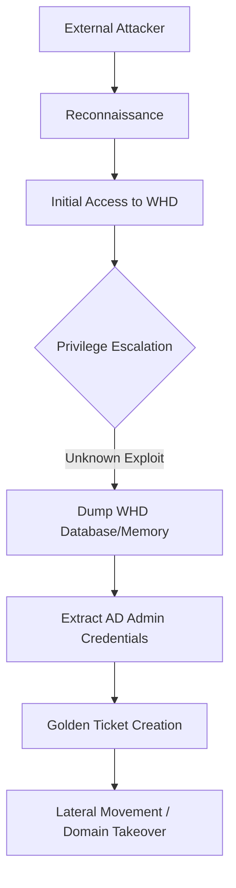

## 서론

새벽 3시, SOC(Security Operation Center) 모니터링 화면의 SolarWinds Web Help Desk(WHD) 서버에서 의심스러운 아웃바운드 트래픽이 감지되었습니다. 처음에는 단순한 오작동이나 사용자 실수일 것이라 예측했지만, 조사 결과 이것은 단순한 장애가 아니었습니다. 공격자는 당신의 조직에서 가장 민감한 정보, 즉 도메인 관리자(Domain Admin) 수준의 Credential(자격 증명)을 노리고 있었습니다.

이번 공격의 가장 큰 특징은 '알 수 없는 방법(Uknown Vector)'과 '명확한 목표' 간의 괴리입니다. 아직 구체적인 제로데이(Zero-day) 취약점이나 공격 경로가 공개되지 않았지만, 공격자들은 SolarWinds WHD라는 신뢰할 수 있는 시스템을 타깃으로 삼아 권한 상승(Pivoting)을 시도하고 있습니다. Help Desk 솔루션은 기본적으로 IT 운영의 핵심이자 AD(Active Directory)와 연동되는 경우가 많아, 한번 장악되면 전체 인프라가 무너질 수 있는 '성(Citadel)'과 같습니다. 우리는 지금 보이지 않는 적에 맞서 가장 강력한 키를 지켜야 하는 상황에 처해 있습니다.

## 본론: 공격 메커니즘과 위협 분석

### ⚠️ 윤리적 경고

본 섹션에서 설명하는 공격 시나리오와 기술적 분석은 오직 방어 목적과 시스템 취약성 이해를 위한 학습용으로 제공됩니다. 무단 접속이나 악의적인 활용은 엄격히 금지되며 법적 책임을 초래할 수 있습니다.

### 공격 시나리오: Trust 관계의 악용

SolarWinds WHD와 같은 헬프데스크 솔루션은 일반적으로 사용자 지원을 위해 Active Directory나 LDAP과 연동됩니다. 이 과정에서 서비스는 '로그온 as 서비스' 권한이나 특정 계정의 자격 증명을 저장하게 됩니다. 공격자는 이 신뢰 관계(Trust Relationship)를 공략합니다.

공격자의 목표는 WHD 자체를 파괴하는 것이 아니라, WHD가 가진 고권한 Credential을 탈취하여 네트워크 전체로 확산(Lateral Movement)하는 것입니다. 현재 관측되는 공격 시나리오는 다음과 같은 단계로 진행됩니다.



### 기술적 분석: 취약점 벡터 예측

현재 구체적인 취약점(CVE)은 공개되지 않았으나, 유사한 웹 애플리케이션 공격 패턴을 바탕으로 다음과 같은 벡터를 의심해야 합니다.

1.  **인증 우회 및 세션 하이재킹**: 특정 엔드포인트에서 인증 절차를 우회하거나 세션 토큰 조작을 통해 관리자 권한을 획득.
2.  **데이터베이스 직접 접근**: SQL 인젝션 등을 통해 WHD의 내부 DB에 접근, 암호화된 Credential을 직접 탈취.
3.  **직렬화 취약점(Deserialization)**: 악의적인 객체 전송을 통해 서버에서 원격 코드 실행(RCE)을 유도하고 메모리상의 Credential을 덤프.

이 중 최근 SolarWinds 제품군의 이력을 고려할 때, **직렬화 취약점이나 인증 로직의 논리적 결함**이 가장 유력한 의심 대상입니다. WHD는 Java 기반으로 구동되는 경우가 많으며, 오래된 라이브러리 의존성으로 인해 체이닝이 가능한 익스플로잇이 존재할 가능성이 큽니다.

### PoC: Credential 유출 시뮬레이션 (방어적 관점)

방어자의 입장에서 공격이 성공했을 때 어떻게 Credential이 유출되는지 이해하는 것이 중요합니다. 아래 코드는 WHD 설정 파일이나 메모리 덤프에서 민감한 정보가 노출되었을 때, 이를 탐지하는 시뮬레이션 코드입니다.

**참고**: 실제 환경에서는 WHD 서버 내의 로그 파일이나 메모리 덤프를 분석해야 합니다.

```python
import re

def simulate_credential_leak_analysis(log_data):
    """
    방어 목적: 시스템 로그나 덤프 데이터에서 민감한 Credential 패턴 탐지
    """
    # 일반적인 Credential 패턴 (Base64 인코딩된 문자열, 연속된 특수문자 등)
    # 실제 공격자는 이를 위해 정교한 정규식을 사용합니다.
    sensitive_patterns = [
        r'password\s*=\s*[\'"].*?[\'"]',
        r'connectionString\s*=\s*[\'"].*?[\'"]',
        r'(AD|LDAP)_\w+_CREDENTIAL\s*=\s*[\'"].*?[\'"]',
        r'[A-Za-z0-9+/]{40,}={0,2}' # Potential Base64 Encoded Data
    ]

    detected_risks = []
    
    for pattern in sensitive_patterns:
        matches = re.findall(pattern, log_data, re.IGNORECASE)
        if matches:
            detected_risks.extend(matches)

    return detected_risks

# 시나리오: 공격자가 WHD 설정 파일(config.xml)을 탈취한 상황 가정
leaked_log_snippet = """
<Database>
    <ConnectionString>jdbc:mysql://db-server:3306/whd</ConnectionString>
    <User>root</User>
    <Password>P@ssw0rd!123#Secret</Password>
</Database>
<ADIntegration>
    <AdminUser>svc_whd_admin</AdminUser>
    <AdminCredential>U3VwZXJTZWNyZXRBZG1pbjE=</AdminCredential>
</ADIntegration>
"""

print("=== [PoC] 보안 로그 분석 결과 ===")
risks = simulate_credential_leak_analysis(leaked_log_snippet)

if risks:
    print("[ALERT] 민감한 Credential 패턴이 탐지되었습니다:")
    for risk in risks:
        print(f"- {risk}")
else:
    print("[SAFE] 탐지된 위협 없음.")
```

이 코드가 실행된다면, 공격자는 복호화 키만 확보하거나 기본 인증 방식을 우회하여 즉시 AD 관리자 권한을 획득할 수 있는 상태가 됩니다.

### 현장 대응 가이드: Step-by-Step

현재 SolarWinds WHD를 운영 중인 보안 팀은 즉시 다음 단계를 수행해야 합니다.

| 단계 | 조치 항목 | 상세 설명
|:--- | :--- | :---
|**1. 격리 (Isolation)** | 네트워크 세그먼트 분리 | WHD 서버를 인터넷 및 내부 AD와 일시적으로 격리하여 공격 트래픽 차단
|**2. 자격 증명 롤오버 (Rotation)** | 모든 연동 계정 비번 변경 | WHD가 사용하는 DB 계정, AD 연동 서비스 계정, 로컬 관리자 계정 비밀번호 즉시 변경
|**3. 로그 포렌식 (Forensics)** | 접속 로그 심층 분석 | 최근 30일간의 접속 로그, 실패한 로그인 시도, 알 수 없는 프로세스 실행 기록 확인
|**4. 패치 및 완화 (Mitigation)** | 벤더 권고사항 적용 | SolarWinds 공식 보안 권고(Security Advisory) 확인 및 긴급 패치 적용 (혹은 임시 서비스 중지) |

### 완화 조치: WAF 및 보안 규칙 설정

구체적인 취약점이 알려지지 않았으므로, **가상 패칭(Virtual Patching)** 개념으로 접근해야 합니다. WAF(Web Application Firewall)나 방화벽에 다음과 같은 규칙을 적극적으로 활용하십시오.

1.  **IP 화이트리스팅**: WHD 관리자 페이지(`/helpdesk/WebObjects/Helpdesk.woa`)에 대해 내부 IP에서만 접근 허용.
2.  **입력값 검증 강화**: 의심스러운 직렬화 페이로드(Java Serialized Object 헤더 등) 탐지 규칙 추가.
3.  **비정상적인 아웃바운드 차단**: WHD 서버가 C2 서버로 추정되는 알 수 없는 외부 IP로 통신하는지 모니터링.

## 결론

SolarWinds WHD를 대상으로 한 이번 공격 캠페인은 "우리는 당신의 시스템을 어떻게 뚫을지 모르지만, 결국 뚫고 들어가 핵심 키를 가져가겠다"는 공격자의 집요한 의지를 보여줍니다. 보안의 패러다임이 '취약점 발견->패치'에서 '탐지->대응'으로 이동해야 하는 이유가 바로 이것입니다.

핵심은 **"신뢰의 최소화"**입니다. Help Desk 소프트웨어가 편리하다는 이유로 과도한 관리자 권한을 부여하거나, 영구적인 Credential을 저장하는 관행은 이제 재고되어야 합니다. 공격 경로가 파악되지 않은 현 시점에서는 가장 기본적인 보안 원칙인 최소 권한 원칙(Principle of Least Privilege)과 네트워크 격리만이 최후의 보루입니다.

이번 사태는 SolarWinds 사용자뿐만 아니라, 모든 IT 관리 도구를 사용하는 조직에 경종을 울립니다. "관리용 도구는 안전하다"는 착각을 버리고, 관리 도구 자체를 공격의 최전선으로 간주하고 보안 강화 작업에 착수하시기 바랍니다.

### 참고자료 및 링크

- [The Register - Someone's attacking SolarWinds WHD to steal high-privilege credentials](https://www.theregister.com/)

- [SolarWinds Security Advisories](https://www.solarwinds.com/trust-center/security-advisories)

- [CISA - Understanding and Responding to Supply Chain Attacks](https://www.cisa.gov/)
