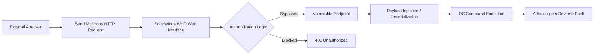

## 서론

새벽 2시, 보안 관제 센터의 모니터를 가득 채우는 경보음. 평소와 다르지 않은 일상처럼 보였지만, 이번에는 달랐습니다. 내부 네트워크의 핵심인 IT 자산 관리 시스템인 SolarWinds Web Help Desk(WHD)가 이상 징후를 보이기 시작한 것입니다. 공격자는 이미 방화벽을 넘어섰고, 인증 과정을 우회하여 시스템의 내부 깊숙한 곳에 발을 들여놓았습니다.

이 시나리오는 이제 영화 속 이야기가 아닙니다. SolarWinds Web Help Desk의 취약점이 현재 전 세계의 위협 행위자(Threat Actors)들에 의해 적극적으로 악용되고 있기 때문입니다. 단순히 서비스가 중단되는 수준을 넘어, 공격자는 이 취약점을 이용해 원격 코드 실행(RCE) 권한을 획득하고 내부 네트워크를横向 이동(Lateral Movement)합니다. 왜 우리는 지금 이 취약점에 집중해야 할까요? 바로 '인증 우회(Authentication Bypass)'라는 특성 때문입니다. 가장 강력한 보안 장벽인 '로그인' 과정 자체가 무력화되는 순간, 그 뒤에 어떤 보안 장비가 있든 의미가 퇴색됩니다. 본 분석에서는 공격자가 실제로 어떻게 이 허점을 노리는지, 그리고 우리는 어떻게 이 흐름을 차단할 수 있는지 현장감 있는 기술적 관점에서 파헤쳐 보겠습니다.

> **⚠️ 윤리적 경고**: 본 문서에 포함된 기술적 세부 사항과 코드는 오직 방어 목적과 취약점 이해를 위한 학습용으로 제공됩니다. 승인되지 않은 시스템에 대한 테스트는 불법이며 엄격히 금지됩니다.

## 본론

### 취약점의 기술적 메커니즘: 인증 우회에서 RCE까지

SolarWinds Web Help Desk(WHD)는 기업 내부의 IT 요청을 처리하는 중요한 웹 애플리케이션입니다. 최근 보고된 주요 취약점(CVE-2024-28987 등 유사 계열)의 핵심은 특정 엔드포인트에서 인증 검증 로직의 결함을 악용한다는 점입니다.

공격자는 복잡한 암호 해독이 필요 없습니다. 단순히 HTTP 요청을 조작하여 취약한 API 엔드포인트를 호출함으로써, 마치 정상적인 관리자인 것처럼 시스템을 속입니다. 이 인증 우회가 성공하면, 공격자는 서버 사이드에서 임의의 명령을 실행할 수 있는 권한(RCE)을 얻게 됩니다. 이는 공격자에게 시스템 쉘(Shell) 접근 권한을 부여하는 것과 같습니다.

아래 다이어그램은 공격자가 인증 우회 취약점을 통해 시스템 장악(SHELL)까지 이르는 전체 공격 체인(Chain of Attack)을 시각화한 것입니다.



### 공격 시나리오 분석 및 PoC

공격자는 대상 네트워크에서 SolarWinds WHD가 설치된 서버를 먼저 탐지합니다. 주로 포트 스캔을 통해 `8080`이나 `443` 포트에서 운영되는 WHD 서비스를 식별합니다. 이후, 인증이 필요한 `/helpdesk/WebObjects/Helpdesk.woa`와 같은 특정 경로나 API 엔드포인트에 조작된 패킷을 전송합니다.

다음은 공격자가 취약점을 진단(Vulnerability Assessment)하기 위해 작성할 수 있는 개념 증명(PoC) 파이썬 스크립트의 예시입니다.

**⚠️ 주의**: 아래 코드는 학습 및 방어 목적의 구조적 예시이며, 악의적인 목적으로 사용할 수 없도록 안전장치가 필요합니다.

```python
import requests

# 방어 목적의 취약점 진단 스크립트 예시
target_url = "http://vulnerable-whd-server:8080/helpdesk/WebObjects/Helpdesk.woa"

# 취약점을 트리거할 수 있는 구조의 헤더 및 파라미터 구성 (실제 익스플로잇과는 다름)
headers = {
    "User-Agent": "SecurityScanner/1.0",
    "Content-Type": "application/x-www-form-urlencoded"
}

# 인증 우회 시도를 위한 악의적인 쿠키 또는 파라미터 구성
# 공격자는 세션 관리의 허점을 노리기 위해 특정 쿠키 값을 조작할 수 있음
payload_data = {
    "woSession": "attacker_controlled_session_id",
    "username": "admin", # 인증을 우회하기 위한 시도
    "action": "ExecuteCommand"
}

def check_vulnerability():
    print(f"[*] Target: {target_url}")
    try:
        # 요청 전송 (타임아웃 설정으로 서버 과부하 방지)
        response = requests.post(target_url, headers=headers, data=payload_data, timeout=5)
        
        # 인증 우회 시 서버는 401 대신 200 OK나 500 Internal Server Error(오류 발생 시)를 반환할 수 있음
        if response.status_code == 200 and "root:" in response.text:
            print("[!] WARNING: Potential Remote Code Execution vulnerability detected!")
            print(f"[!] Response snippet: {response.text[:100]}")
        elif response.status_code == 401 or response.status_code == 403:
            print("[+] Secure: Authentication seems to be enforced.")
        else:
            print(f"[-] Status Code: {response.status_code} - Further analysis required.")
            
    except requests.exceptions.RequestException as e:
        print(f"[Error] Connection failed: {e}")

if __name__ == "__main__":
    # 윤리적 사용: 본인이 소유하거나 테스트 허가를 받은 시스템에서만 실행하세요.
    check_vulnerability()
```

이 코드는 단순히 요청을 보내고 응답을 분석하는 구조입니다. 실제 공격에서는 이 과정을 통해 `curl`, `wget`, `powershell` 등의 시스템 명령어를 서버에 주입하여 백도어(Backdoor)를 설치합니다.

### 공격 유형별 영향도 비교

이 취약점이 왜 다른 일반적인 웹 취약점(SQLi, XSS 등)보다 위험한지 비교해 보겠습니다.

| 비교 항목 | 일반적인 웹 공격 (SQLi, XSS) | SolarWinds WHD RCE (Auth Bypass) |
| :--- | :--- | :--- |
| **필요한 권한** | 일반 사용자 권한 또는 게스트 권한 | **없음 (No Authentication)** |
| **주요 피해 형태** | 데이터 유출, 웹사이트 변조, 클라이언트 공격 | **서버 장악, 내부 네트워크 침투, 랜섬웨어** |
| **탐지 난이도** | 중간 (WAF 로그 분석 가능) | **높음 (정상 트래픽으로 위장 가능)** |
| **공격 범위** | 해당 웹 애플리케이션 데이터베이스 | **운영체제 전체 및 연결된 내부망** |
| **완화 긴급성** | 일반 (주기적 패치) | **긴급 (즉시 패치 필요)** |

### 단계별 대응 및 완화 가이드 (Step-by-Step)

이미 공격이 시작되었거나 취약점이 존재할 가능성이 높은 환경에서 취해야 할 현실적인 대응 절차는 다음과 같습니다.

**1단계: 즉시 패치 적용 (Immediate Patching)** 가장 확실하고 우선시되어야 할 조치입니다. SolarWinds에서는 이미 이 문제를 해결한 핫픽스(Hotfix)를 배포했습니다.

- **조치**: WHD를 최신 버전(해당 CVE가 수정된 버전)으로 즉시 업그레이드하십시오.

- **참고**: 패치 적용 전 반드시 테스트 환경에서 검증을 진행하세요.

**2단계: 네트워크 격리 및 접근 제어 (Network Segmentation)** WHD는 보통 내부 직원을 위한 도구입니다. 인터넷 망에 직접 노출되어 있다면 이는 큰 보안 리스크입니다.

- **조치**: WHD 관리자 포트(기본 8080 등)를 방화벽으로 막거나, VPN 내부에서만 접근 가능하도록 IP 화이트리스팅을 적용하세요.

```bash
# Linux 방화벽(iptables) 예시: 외부에서의 8080 포트 접근 차단
# 내부 네트워크(예: 192.168.1.0/24)에서만 접근 허용
sudo iptables -A INPUT -p tcp -s 192.168.1.0/24 --dport 8080 -j ACCEPT
sudo iptables -A INPUT -p tcp --dport 8080 -j DROP
```

**3단계: IOC(침해 지표) 기반 로그 검증 (Log Analysis)** 이미 공격을 받았는지 확인해야 합니다. 로그 파일에서 의심스러운 패턴을 찾으십시오.

- **검색 키워드**: `cmd.exe`, `/bin/sh`, `powershell`, `wget`, `curl` 등이 웹 서버 접근 로그에 포함되어 있는지 확인.

- **이상 행위**: 알 수 없는 사용자 계정 생성, 관리자 권한 변경 시도.

**4단계: 자격증명 전면 교체 (Credential Reset)** RCE 취약점은 공격자가 시스템 내의 모든 데이터를 탈취했을 가능성을 시사합니다.

- **조치**: WHD에 저장된 모든 비밀번호, 데이터베이스 계정, 그리고 WHD와 연동된 AD(Active Directory) 계정의 비밀번호를 변경하십시오.

## 결론

SolarWinds Web Help Desk에서 발생한 이번 RCE 취약점 사태는 단순한 소프트웨어의 버그가 아닙니다. 이는 '신뢰할 수 있는 내부 시스템'이 어떻게 악용되어 전체 조직의 보안을 무너뜨리는지를 보여주는 교과서적인 사례입니다. 인증 과정의 우회는 방어자에게 가장 두려운 시나리오 중 하나입니다.

전문가로서의 제 인사이트는 이렇습니다. 우리는 보안 도구를 도입하기 전에, 기본적인 '하이지니스(Hygiene)'부터 점검해야 합니다. 인터넷에 노출될 필요가 없는 서비스는 반드시 격리하고, 패치 관리는 선택이 아닌 생존의 문제여야 합니다. 오늘 분석한 이 공격 벡터는 SolarWinds에만 국한되지 않습니다. 유사한 메커니즘을 가진 수많은 레거시 웹 애플리케이션이 여러분의 네트워크에 도사리고 있을 수 있습니다.

지금 당장 관리 중인 IT 자산 관리 시스템의 로그를 확인하고, 인터넷 노출 여부를 재검토하시기 바랍니다. 보안은 끝이 없는 프로세스이지만, 침해되는 순간은 찰나입니다.

### 참고자료

- [SolarWinds Security Advisories](https://www.solarwinds.com/trust-center/security-advisories)

- [CVE-2024-28987 Detail (NVD)](https://nvd.nist.gov/vuln/detail/CVE-2024-28987)

- [CISA Known Exploited Vulnerabilities Catalog](https://www.cisa.gov/known-exploited-vulnerabilities-catalog)
