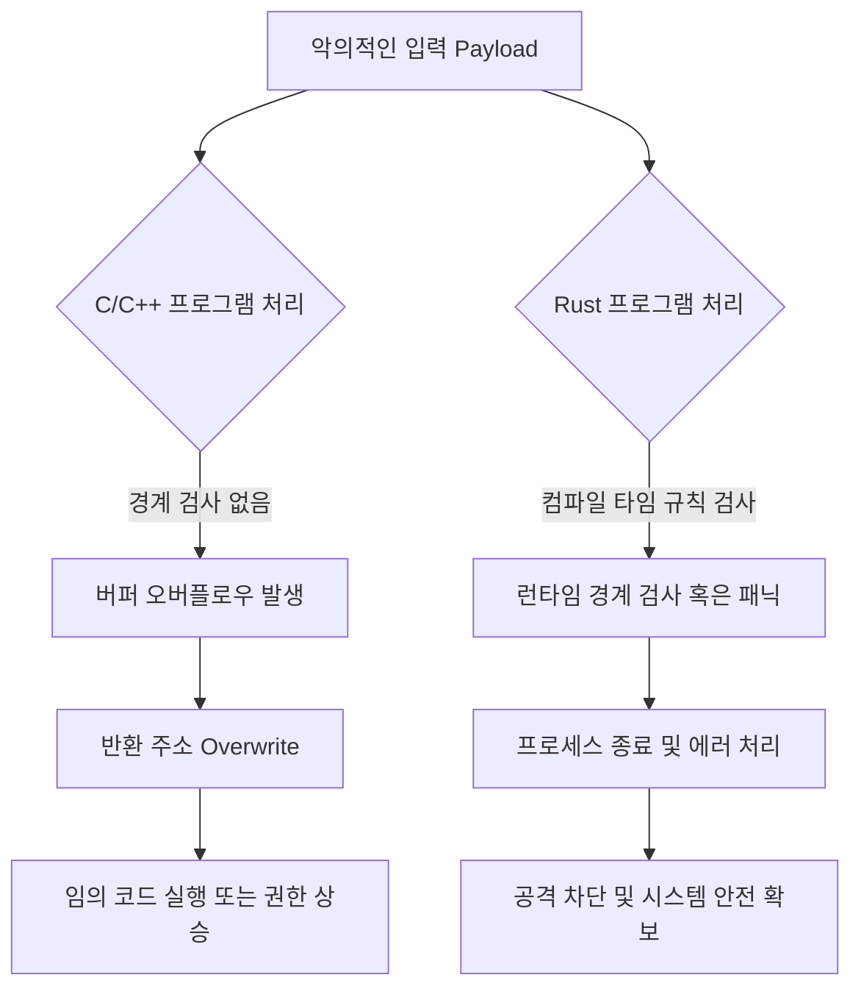

## 서론

2019년, 전 세계를 강타한 `WannaCry` 랜섬웨어의 여파를 기억하시나요? 혹은 수많은 리눅스 서버를 감염시킨 `Dirty COW` 취약점은 어떠신가요. 이들의 공통점은 무엇일까요? 바로 C/C++ 언어의 가장 치명적인 약점인 '메모리 안전성(Memory Safety)' 결함에서 비롯되었다는 점입니다. 버퍼 오버플로우(Buffer Overflow), 해제된 메모리 사용(Use-After-Free), 이중 해제(Double Free)와 같은 오류는 수십 년간 해커들의 친구이자 보안 전문가들의 악몽이었습니다.

보안 엔지니어로서 우리는 방화벽을 높이고 침입 탐지 시스템(IDS)을 배포해 왔지만, 근본적인 원인인 운영체제 커널과 핵심 시스템 소프트웨어의 메모리 취약점은 여전히 '지뢰'와 같았습니다. 이제 Canonical의 우분투가 Rust를 C/C++를 대체하는 기본 언어로 채택하기로 결정한 것은 단순한 언어 교체가 아닙니다. 이는 **수십 년간 지속된 메모리 안전성 전쟁에서의 획기적인 방어 전략**이자, 시스템 수준의 보안 패러다임 시프트입니다. 이 글에서는 왜 보안 관점에서 우분투의 이번 결정이 그토록 중요한지, 그리고 Rust가 실제로 어떻게 해킹 시나리오를 차단하는지 기술적으로 심도 있게 분석해 보겠습니다.

---

## 본론

### 메모리 안전성 위협과 Rust의 방어 기제

전통적인 C/C++ 코드에서 발생하는 취약점의 상당수는 프로그래머가 메모리 주소를 직접 조작하거나 메모리 수명을 수동으로 관리하다 발생합니다. 공격자는 이러한 실수를 악용해 임의 코드 실행을 유도하거나 권한을 상승(Privilege Escalation)시킵니다.

반면, Rust는 컴파일 타임에 소유권(Ownership), 대여(Borrowing), 수명(Lifetime)이라는 독특한 메커니즘을 통해 메모리 안전성을 강제합니다. 이는 런타임에 가비지 컬렉터(GC)가 동작하는 것과 달리, 성능 저하 없이 컴파일러 단계에서 취약점을 원천 봉쇄한다는 점에서 보안적으로 매우 강력합니다.

다음은 C언어의 메모리 취약점 공격 흐름과 Rust가 이를 어떻게 차단하는지 비교한 다이어그램입니다.



위 다이어그램에서 볼 수 있듯, C/C++는 메모리 경계를 넘어선 쓰기를 허용하여 공격으로 이어질 수 있지만, Rust는 이를 시도조차 하지 못하게 하거나, 실행되더라도 프로그램을 안전하게 종료시켜 공격 체인을 끊어버립니다.

### 취약점 시나리오 분석: C vs Rust

(주의: 아래 코드는 보안 교육 및 방어 목적을 위한 학습용 예시입니다.)

#### 1. 취약한 C 코드 예시 (Buffer Overflow)

대부분의 오래된 시스템 소프트웨어는 다음과 같이 `strcpy` 함수를 사용하여 안전한 길이 검사 없이 문자열을 복사합니다.

```c
#include <stdio.h>
#include <string.h>

void vulnerable_function(char *user_input) {
    char buffer[16];
    // 길이 검사 없이 입력을 복사함
    strcpy(buffer, user_input); 
    printf("Input processed: %s
", buffer);
}

int main(int argc, char *argv[]) {
    if (argc > 1) {
        vulnerable_function(argv[1]);
    }
    return 0;
}
```

공격자가 `buffer`의 크기(16바이트)보다 큰 입력을 보내면, 스택의 반환 주소(Return Address)를 덮어쓸 수 있습니다. 이를 통해 공격자는 프로그램의 실행 흐름을 조작하여 악성 코드(Shellcode)를 실행시킬 수 있습니다. 이것이 전형적인 스택 버퍼 오버플로우(Stack Buffer Overflow) 공격입니다.

#### 2. 안전한 Rust 코드 예시 (Compile-time Protection)

동일한 로직을 Rust로 구현하면 어떻게 될까요?

```rust
fn safe_function(user_input: &str) {
    // 고정 크기 배열 (스택 할당)
    let mut buffer = [0u8; 16];
    
    // Rust는 slice 길이를 자동으로 확인하거나, 
    // 불안전한 메모리 접근을 시도하면 컴파일 에러를 발생시킵니다.
    let input_bytes = user_input.as_bytes();
    
    if input_bytes.len() > buffer.len() {
        panic!("Input too large! Potential overflow detected.");
    }
    
    // 안전한 복사 (copy_from_slice는 길이가 같지 않으면 패닉 발생)
    buffer[..input_bytes.len()].copy_from_slice(input_bytes);
    
    println!("Input processed: {:?}", buffer);
}

fn main() {
    let test_input = "This is a very long string that exceeds buffer size";
    safe_function(test_input);
}
```

Rust의 컴파일러는 메모리 안전 규칙을 엄격하게 적용합니다. 만약 개발자가 `unsafe` 블록을 사용하여 명시적으로 이 규칙을 우회하지 않는 한, 버퍼 오버플로우는 발생할 수 없습니다. 위 코드는 입력이 버퍼 크기를 초과할 경우 `panic!`을 호출하여 프로그램을 즉시 종료시킴으로써, 공격자가 메모리를 조작할 기회를 원천 차단합니다.

### C/C++와 Rust의 보안적 특성 비교

우분투가 왜 C/C++를 걷어내고 Rust로 이동하려 하는지 명확하게 보여주는 비교표입니다.

| 비교 항목 | C / C++ | Rust |
| :--- | :--- | :--- |
| **메모리 관리** | 수동 관리 (Malloc/Free, Pointers) | 소유권 시스템 (컴파일러 관리) |
| **메모리 안전성** | 안전하지 않음 (Use-After-Free, Double Free 가능) | 메모리 안전 보장 (GC 없이 안전성 확보) |
| **데이터 레이스(Data Race)** | 런타임에 발견 어려움 (Thread Safety 미보장) | 컴파일 타임에 데이터 레이스 감지 및 방지 |
| **Null Pointer** | 존재함 (Segmentation Fault 주범) | `Option` 타입으로 Null 개념 자체를 배제 |
| **공격 표면적** | 높음 (메모리 조작 취약점 다수) | 낮음 (논리적 버그 이외의 메모리 버그 발생 어려움) |
| **성능** | 극히 우수 (하지만 안전장치 미탑재 시 비용 발생) | C/C++와 대등한 성능 (Zero-cost abstractions) |

### 실무 적용 가이드: 우분투 환경에서의 Rust 마이그레이션

보안 엔지니어나 시스템 개발자로서 우분투의 새로운 방향성에 맞춰 나가기 위해 고려해야 할 단계별 가이드입니다.

#### Step 1: 개발 환경 구성 우분투 최신 버전에서는 Rust 툴체인 설치가 매우 간편합니다.

```bash
# rustup 설치 (Rust 버전 관리자)
curl --proto '=https' --tlsv1.2 -sSf https://sh.rustup.rs | sh

# 환경 변수 설정
source $HOME/.cargo/env

# 필수 구성요소 빌드 도구 설치
sudo apt update
sudo apt install build-essential pkg-config libssl-dev
```

#### Step 2: 안전하지 않은 코드(Unsafe) 감사 기존 C/C++ 코드를 Rust로 포팅하거나 FFI(Foreign Function Interface)를 통해 연결할 때, `unsafe` 블록은 적의 눈이 됩니다.

- **원칙**: `unsafe` 블록은 최소화해야 합니다.

- **감사**: 모든 `unsafe` 코드는 별도의 보안 코드 리뷰(Secure Code Review) 대상으로 분류하여야 합니다.

#### Step 3: 기존 C 라이브러러리와의 연동 (Bindings) Rust는 기존의 검증된 C 라이브러리를 사용할 수 있습니다. `bindgen` 도구를 사용하여 C 헤더 파일을 Rust로 자동 변환할 수 있습니다.

```bash
# bindgen 설치
cargo install bindgen

# 예시: C 라이브러리 헤더를 Rust 바인딩으로 변환
bindgen /usr/include/some_c_library.h -o bindings.rs
```

---

## 결론

우분투의 Rust 도입 결정은 단순한 "새로운 언어의 유행"이 아닙니다. 이는 지난 40년간 운영체제를 지탱해 온 C/C++의 기술적 부채를 해소하고, **소프트웨어 공급망(Supply Chain)의 가장 상위 단계에서 메모리 안전성을 확보하려는 전략적 결단**입니다.

보안 전문가의 관점에서 이는 매우 고무적입니다. 컴파일러가 잠재적인 해킹 경로를 차단해 준다는 것은, 우리가 방어해야 할 공격 표면이 획기적으로 줄어든다는 것을 의미합니다. 물론, Rust가 모든 보안 문제를 해결해 주는 만능열쇠는 아닙니다. 논리적 오류나 설정 오류는 여전히 존재할 것입니다. 하지만, 전체 고위험 취약점의 70% 이상을 차지하는 메모리 안전 결함을 예방할 수 있다면, 이는 보안 산업의 게임 체인저(Game Changer)임이 분명합니다.

앞으로 리눅스 생태계에서 Rust는 선택이 아닌 필수가 될 것입니다. 지금 당장 Rust 문법을 익히고, 안전한 코딩 패턴을 체득하는 것은 향후 5년 뒤의 경쟁력 있는 보안 엔지니어가 되기 위한 필수 조건입니다.

**참고자료:**

- [Rust Security Initiative](https://www.rust-lang.org/policies/security)

- [Ubuntu Rust Wiki](https://wiki.ubuntu.com/Rust)

- [Microsoft: 70% of vulnerabilities are memory safety issues](https://msrc-blog.microsoft.com/2019/07/18/we-need-a-safe-systems-programming-language/)
