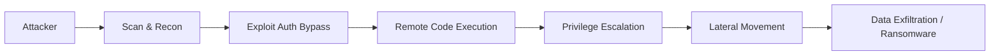

## 서론

새벽 2시, SOC(Security Operations Center) 모니터링 화면에 빨간 불이 깜빡입니다. 평소라면 단순한 서버 오류로 넘겼을 알림이었겠지만, 이번에는 달랐습니다. 인프라 관리의 심장부인 VMware Aria Operations(구 vRealize Operations) 서버에서 의심스러운 아웃바운드 트래픽이 감지된 것입니다. 관리자가 급히 로그를 확인했을 때, 이미 시스템의 권한은 탈취되었고 내부 네트워크로의 횡적 이동(Lateral Movement)이 시작되고 있었습니다.

이것은 단순한 시나리오가 아닙니다. CISA(미국 사이버보안 및 인프라 보안국)가 최근 VMware Aria Operations의 특정 취약점이 현재 **실제 공격(Active Exploitation)**에 악용되고 있다며 경고를 발령한 상황입니다. 관리자들이 가장 신뢰하고 방치해두던 '관리용 시스템'이 역설적으로 가장 취약한 진입점이 되어버린 지금, 우리는 왜 이 문제에 즉각적으로 대응해야 하며, 공격자들은 이를 어떻게 악용하고 있는지 정확히 이해해야 합니다.

---

## 본론

### 기술적 배경 및 공격 원리

VMware Aria Operations는 가상화 환경의 성능을 모니터링하고 최적화하는 핵심 솔루션입니다. 하지만 이러한 '모니터링'과 '제어' 기능을 수행하기 위해, 해당 시스템은 복잡한 웹 서비스 구성을 가지며 다양한 API를 노출하고 있습니다. CISA가 지적한 이번 취약점은 주로 인증 절차의 결함(Authentication Bypass) 혹은 역직렬화(Deserialization) 취약점과 관련이 깊습니다.

최근 보고된 주요 공격 벡터는 특정 API 엔드포인트가 신원 확인을 우회하거나, 신뢰할 수 없는 데이터를 처리하는 과정에서 발생합니다. 공격자는 이 취약점을 이용해 별도의 자격 증명 없이 시스템 내부로 침투할 수 있으며, 이는 곧 관리자 권한 탈취(Privilege Escalation) 및 원격 코드 실행(RCE)으로 이어집니다.

### 공격 시나리오 시각화

공격자가 인터넷에 노출된 VMware Aria Operations 서버를 발견한 후 실제 시스템 장악을 일으키기까지의 흐름은 다음과 같습니다.



### 취약점 분석 및 비교

이번 취약점이 기존의 일반적인 웹 해킹과 다른 점은 '타격의 범위'입니다. Aria Operations는 단순한 웹 애플리케이션이 아니라, vCenter, 네트워크 장비, 스토리지 등 전체 인프라를 제어하는 'God View'를 가집니다.

| 비교 항목 | 일반 웹 애플리케이션 취약점 | VMware Aria Operations 취약점 |
| :--- | :--- | :--- |
| **주요 영향** | 데이터 유출, 웹사이트 변조 | **인프라 장악, 가상머신 삭제/재시작** |
| **공격 난이도** | 중상 (SQLi, XSS 등 다양) | **하 (Exploit 코드 공개 및 자동화 도구 존재)** |
| **후속 조치 가능성** | 웹 방화벽 차단으로 완화 가능 | **패치 적용 전까지 근본적 차단 어려움** |
| **피해 규모** | 서비스 일부 중단 | **전체 데이터센터 다운** |

### PoC 개념 증명 (Proof of Concept)

**⚠️ 윤리적 경고**: 아래 코드는 방어 목적의 학습을 위해 작성된 것이며, 허가 없는 시스템에서 실행하는 것은 불법입니다.

공격자는 주로 HTTP 요청을 조작하여 취약한 엔드포인트에 악의적인 명령을 전달합니다. 다음은 파이썬을 사용하여 특정 API 엔드포인트의 응답을 확인하고 취약성 여부를 검증하는 개념적 스크립트입니다.

```python
import requests

def check_vulnerability(target_url):
    """
    대상 서버의 특정 엔드포인트를 프로브하여 취약성을 확인하는 개념적 함수입니다.
    실제 공격 코드는 포함되어 있지 않으며, 응답 헤더 및 상태 코드 분석에 중점을 둡니다.
    """
    headers = {
        "User-Agent": "SecurityScanner/1.0",
        "Content-Type": "application/json"
    }
    
    # 취약한 것으로 알려진 예시 엔드포인트 (실제 경로는 벤더 권고를 참조)
    endpoint = "/casa/nova/slice/synchronization/status"
    full_url = f"{target_url}{endpoint}"
    
    try:
        # 타임아웃을 설정하여 안전하게 검사 수행
        response = requests.get(full_url, headers=headers, timeout=5, verify=False)
        
        if response.status_code == 200:
            print(f"[!] Target: {target_url}")
            print(f"[!] Status: Potentially Vulnerable (HTTP 200 OK)")
            print(f"[!] Response Length: {len(response.content)} bytes")
            # 실제 공격 시나리오에서는 여기서 추가 페이로드 전송 시도
        else:
            print(f"[-] Target: {target_url} - Not Vulnerable or Patched (Status: {response.status_code})")
            
    except requests.exceptions.RequestException as e:
        print(f"Error connecting to {target_url}: {e}")

# 테스트 대상 URL (예시)
# check_vulnerability("http://192.168.1.100")
```

### Step-by-step 완화 조치 가이드

CISA 경고와 벤더의 보안 권고에 따라 관리자는 다음 단계를 즉시 수행해야 합니다.

**1단계: 즉시 패치 적용 (Patch Immediately)** 가장 확실한 대책은 패치 적용입니다. VMware가 배포한 VMSA(VMware Security Advisories)를 확인하여 영향을 받는 버전을 업데이트하십시오. Aria Operations는 정기적인 업데이트가 중요하지만, 이번처럼 'Active Exploited' 등급의 취약점은 운영 중단의 리스크를 감수하고서라도 즉시 적용해야 합니다.

**2단계: 네트워크 접근 제어 (Network Segmentation)** Aria Operations 관리 콘솔은 인터넷에 직접 노출되어서는 안 됩니다. 만약 외부 접근이 필요하다면 VPN을 경유하거나 Bastion Host를 거치게 해야 합니다.

```bash
# iptables 예시: 관리 콘솔(8443) 접근을 특정 관리자 IP로만 제한
iptables -A INPUT -p tcp --dport 8443 -s <관리자_IP> -j ACCEPT
iptables -A INPUT -p tcp --dport 8443 -j DROP
```

**3단계: 자격 증명 및 키 순환 (Credential Rotation)** 이미 공격이 발생했을 가능성을 배제할 수 없으므로, 패치 후에는 모든 관리자 계정 비밀번호를 변경하고 API 키를 재발급 받아야 합니다. 공격자가 백도어 계정을 생성했을 수 있기 때문에 사용자 목록 감사(IAM Audit)도 필수적입니다.

**4단계: IOCs(Indicators of Compromise) 검사** 시스템 로그에서 다음과 같은 징후가 있는지 확인하십시오.

- 알 수 없는 사용자 계정의 생성 시도

- 비정상적인 시간대의 대용량 데이터 전송

- `/casa` 또는 `/suite-api` 경로에 대한 의심스러운 POST 요청

---

## 결론

이번 VMware Aria Operations 취약점 사태는 우리에게 '관리용 플랫폼'의 보안이 얼마나 중요한지를 다시금 상기시킵니다. 모니터링 도구라는 편리함에 안주하여 방화벽 뒤편에 방치해 둔 시스템들이 오히려 공격자들의 '은밀한 성채'로 악용되고 있습니다.

CISA가 "실제 악용 중"이라고 경고했다는 것은, 이미 익스플로잇(Exploit) 코드가 해커 커뮤니티나 오픈 소스 도구를 통해 확산되었음을 의미합니다. 이제는 '방어적'인 자세에서 벗어나 '선제적'인 대응이 필요합니다. 단순히 패치를 설치하는 것을 넘어, 관리 계정의 권한을 최소화하고 네트워크 접근을 철저히 분리하는 제로 트러스트(Zero Trust) 원칙을 인프라 관리 시스템에도 적용해야 합니다.

사이버 보안의 끝은 없습니다. 오늘 Aria Operations를 패치했다면, 내일은 또 다른 관리 도구가 표적이 될 수 있습니다. 중요한 것은 시스템의 모든 구성 요소가 잠재적인 공격 경로가 될 수 있음을 인지하고, 지속적인 모니터링과 즉각적인 대응 체계를 갖추는 것입니다. 지금 당장 서버의 로그를 확인하고, 최신 보안 권고사항을 검토하십시오.

**참고자료:**

- [CISA Known Exploited Vulnerabilities Catalog](https://www.cisa.gov/known-exploited-vulnerabilities-catalog)

- [VMware Security Advisories (VMSA)](https://www.vmware.com/security/advisories.html)
