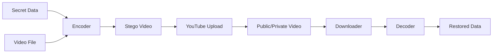

## 서론

상황을 하나 가정해 보겠습니다. 한 기업의 내부망에서 일하는 악의적인 내부자가 테라바이트(TB) 단위의 설계도와 소스 코드를 외부로 빼돌려 합니다. 방화벽은 일반적인 파일 업로드 웹사이트나 이메일 첨부 파일을 차단하고 있으며, DLP(데이터 유출 방지) 솔루션이 포트를 감시하고 있습니다. 하지만 이 공격자는 회사의 보안 정책상 허용된 유일한 대역폭 포트인 HTTPS 443번을 통해 YouTube로 동영상을 "스트리밍"하고 있었습니다.

보안 전문가로서 우리는 보통 클라우드 스토리지(AWS S3, Dropbox 등)나 피어 투 피어(P2P) 네트워크에 집중하곤 합니다. 하지만 우리의 눈앞에 있는, 그 누구도 의심하지 않는 플랫폼이 거대한 스토리지 창고로 변모할 수 있습니다. 바로 **YouTube**입니다.

YouTube는 매분 수십 시간 분량의 영상이 업로드되는 거대한 미디어 플랫폼입니다. 구글은 거의 무제한에 가까운 스토리지와 대역폭을 제공합니다. 이를 활용해 영상 파일 내에 데이터를 은닉하는 스테가노그래피(Steganography) 기법을 결합하면, 비용이 들지 않고 탐지되기 어려운 '코버트 채널(Covert Channel)'을 구축할 수 있습니다. 이 글에서는 단순히 동영상을 보관하는 것을 넘어, 보안 관점에서 이 기술이 어떻게 데이터 은닉 및 유출 수단으로 악용될 수 있는지, 그리고 우리는 이를 어떻게 탐지해야 하는지 심도 있게 다루겠습니다.

> **⚠️ 윤리적 경고**: 본 문서에서 설명하는 기술과 코드는 보안 연구 및 방어 목적을 위한 학습용입니다. 이 기술을 타인의 데이터를 훔치거나 불법적인 행위에 사용하는 것은 엄격히 금지되며 법적 책임을 질 수 있습니다.

---

## 본론

### 1. 기술적 원리: 비디오 스테가노그래피 (Video Steganography)

이 기법의 핵심은 **스테가노그래피(Steganography)**, 즉 '정보를 숨기는 기술'입니다. 암호화(Cryptography)가 데이터의 내용을 난독화한다면, 스테가노그래피는 데이터의 존재 자체를 숨깁니다.

YouTube에 데이터를 저장할 때 사용하는 가장 일반적인 방법은 **LSB(Least Significant Bit)** 방식입니다. 이미지나 영상은 픽셀(R, G, B 값)의 집합입니다. 각 색상 값은 8비트(0~255)로 표현되는데, 사람의 눈은 가장 낮은 자리 비트(1비트)가 변하더라도 그 차이를 거의 인지하지 못합니다.

예를 들어, 빨간색 픽셀 값이 `10011100`(156)이라고 가정해 봅시다. 이 마지막 비트를 우리가 숨기고 싶은 데이터의 비트(0 또는 1)로 바꿔도 색상 변화는 미미하여 육안으로 식별이 불가능합니다. 이 방식을 영상의 모든 프레임에 적용하면, 1분 분량의 1080p 영상 하나에 수십 MB에서 수백 MB의 데이터를 숨길 수 있습니다. YouTube가 이 영상을 인코딩(재압축)하더라도, 오디오 트랙이나 특정 프레임에 충분히 중복성을 높여 데이터를 삽입하면 복구가 가능합니다.

### 2. 공격 흐름도 (Attack Flow)

데이터 유출이나 저장을 위한 프로세스는 다음과 같이 단순화할 수 있습니다.



1.  **준비**: 은닉할 비밀 데이터(문서, 압축 파일 등)와 일반적인 동영상 파일(커버 파일)을 준비합니다.
2.  **인코딩 (Encoding)**: 스크립트를 사용해 비밀 데이터를 동영상의 픽셀 또는 오디오 웨이브에 LSB 기법으로 주입합니다.
3.  **업로드 (Upload)**: 생성된 동영상을 YouTube에 업로드합니다. 외부에서 보기에는 평범한 vlog나 동영상입니다.
4.  **다운로드 및 디코딩 (Download & Decoding)**: 필요한 시점에 영상을 다운로드하고, 스크립트를 통해 LSB에서 비트를 추출하여 원본 데이터를 복구합니다.

### 3. 실습: Python을 이용한 LSB 스테가노그래피 구현

이제 개념을 증명하기 위해 Python을 사용해 간단한 이미지 스테가노그래피 코드를 작성해 보겠습니다. (영상은 이미지의 연속이므로 원리는 동일합니다.)

아래 코드는 문자열 데이터를 이미지에 숨기고, 다시 추출하는 PoC(Proof of Concept)입니다.

**필요 라이브러리:**

```bash
pip install pillow
```

**코드 예시:**

```python
from PIL import Image
import base64

def encode_image(image_path, secret_data, output_path):
    """
    이미지에 데이터를 숨겨서 저장하는 함수
    """
    img = Image.open(image_path)
    
    # 데이터를 길이 정보와 함께 바이트로 변환
    data_bytes = secret_data.encode('utf-8')
    data_len = len(data_bytes)
    
    # 데이터가 너무 크면 에러 처리 (단순화를 위해 생략)
    
    # 이미지를 픽셀 단위로 접근 가능한 객체로 변환
    encoded_img = img.copy()
    pixels = encoded_img.load()
    
    width, height = img.size
    data_index = 0
    
    # 데이터 길이를 숨기기 위한 헤더 (첫 32비트 사용)
    length_bits = format(data_len, '032b')
    
    # 헤더 숨기기 (첫 16픽셀의 R 채널 사용)
    header_idx = 0
    for x in range(16):
        r, g, b = pixels[x, 0]
        # R 값의 최하위 비트를 길이 정보의 비트로 변경
        r = (r & ~1) | int(length_bits[header_idx])
        header_idx += 1
        pixels[x, 0] = (r, g, b)

    # 실제 데이터 숨기기 (이후 픽셀부터)
    data_bits = ''.join([format(byte, '08b') for byte in data_bytes])
    pixel_idx = 16 # 헤더 이후부터 시작
    bit_idx = 0
    
    for y in range(height):
        for x in range(width):
            if pixel_idx >= width * height or bit_idx >= len(data_bits):
                break
            r, g, b = pixels[x, y]
            
            # R 채널의 LSB에 데이터 비트 삽입
            if bit_idx < len(data_bits):
                r = (r & ~1) | int(data_bits[bit_idx])
                bit_idx += 1
            
            # G 채널의 LSB에 데이터 비트 삽입
            if bit_idx < len(data_bits):
                g = (g & ~1) | int(data_bits[bit_idx])
                bit_idx += 1
            
            # B 채널의 LSB에 데이터 비트 삽입
            if bit_idx < len(data_bits):
                b = (b & ~1) | int(data_bits[bit_idx])
                bit_idx += 1
                
            pixels[x, y] = (r, g, b)
        if bit_idx >= len(data_bits):
            break
            
    encoded_img.save(output_path)
    print(f"데이터가 {output_path}에 숨겨졌습니다.")


```

```python
def decode_image(image_path):
    """
    이미지에서 숨겨진 데이터를 추출하는 함수
    """
    img = Image.open(image_path)
    pixels = img.load()
    
    # 1. 길이 정보 추출 (첫 16픽셀 R 채널)
    length_bits = ""
    for x in range(16):
        r, _, _ = pixels[x, 0]
        length_bits += str(r & 1)
    
    data_len = int(length_bits, 2)
    print(f"숨겨진 데이터 길이: {data_len} 바이트")
    
    # 2. 실제 데이터 추출
    data_bits = ""
    bit_idx = 0
    required_bits = data_len * 8
    
    for y in range(img.height):
        for x in range(img.width):
            if bit_idx >= required_bits:
                break
            r, g, b = pixels[x, y]
            
            data_bits += str(r & 1)
            bit_idx += 1
            if bit_idx >= required_bits: break
            
            data_bits += str(g & 1)
            bit_idx += 1
            if bit_idx >= required_bits: break
            
            data_bits += str(b & 1)
            bit_idx += 1
        if bit_idx >= required_bits:
            break

    # 비트를 바이트로 변환
    secret_bytes = bytes([int(data_bits[i:i+8], 2) for i in range(0, len(data_bits), 8)])
    return secret_bytes.decode('utf-8')

# 실행 예시 (테스트용)
# 원본 이미지가 필요하므로 실제 실행 시 주석을 해제하세요.
# encode_image("input.jpg", "This is a secret message from Security Expert", "output.png")
# secret = decode_image("output.png")
# print(f"복구된 데이터: {secret}")
```

### 4. 비교 분석: 일반 스토리지 vs YouTube 스토리지

보안 관점에서 이 방식이 기존 클라우드 스토리지와 어떻게 다른지 비교해 보면 왜 이것이 위험한지 명확해집니다.

| 비교 항목 | 일반 클라우드 스토리지 (AWS S3, Dropbox) | YouTube 스토리지 (Steganography) |
| :--- | :--- | :--- |
| **비용** | 저장 용량 및 트래픽에 따라 과금됨 | (거의) 무료 (광고 제공 전제) |
| **탐지 난이도** | 높음 (파일 포맷, 메타데이터 분석 용이) | **매우 높음** (암호화된 스트림처럼 보임) |
| **전송 방식** | 전용 API 또는 프로토콜 (탐지 용이) | HTTPS 스트리밍 (일반 웹 트래픽 위장) |
| **신뢰성** | 높음 (무결성 보장) | 중간 (영상 압축/인코딩 시 데이터 손상 가능) |
| **접근 제어** | 세밀한 권한 설정 (IAM, ACL) | 공개/비공개/링크 공유 (상대적으로 제한적) |

### 5. 데이터 유출(Data Exfiltration) 시나리오 및 방어

이 기술이 실제로 어떻게 악용될 수 있을까요? 해커는 횡적 이동(Lateral Movement)에 성공한 후, 중요한 DB 덤프 파일을 압축합니다. 그 후, 이 압축 파일을 위 코드와 같은 방식(혹은 고도화된 툴)으로 10시간 분량의 '풍경 영상'에 숨깁니다. 이 영상을 회사 계정이나 해킹된 계정으로 YouTube에 업로드합니다. 보안 장비는 단순히 `youtube.com`로의 대용량 트래픽을 "동영상 시청"으로 간주하고 통과시킵니다.

**방어 조치 (Mitigation Strategies):**

1.  **스테가노그래피 탐지 (Steganalysis)**:     *   단순한 패턴 매칭으로는 불가능합니다. 통계적 분석(Chi-square attack 등)을 통해 이미지의 히스토그램이 인위적으로 조작되었는지 확인하는 도구가 필요합니다.
2.  **DLP(데이터 유출 방지) 고도화**:     *   단순 키워드 필터링을 넘어, 미디어 콘텐츠 내부의 엔트로피(무질서도)를 분석하여 암호화나 은닉 데이터가 포함되었는지 의심해야 합니다. 너무 많은 '노이즈'가 포함된 영상은 의심 신호로 간주합니다.
3.  **네트워크 행태 분석**:     *   업무 시간 중 특정 사용자가 YouTube로 지속적인 대용량 업로드를 수행하는지 모니터링해야 합니다. 일반적인 직원의 행동 패턴과 다른 아웃라이어를 탐지하는 것이 중요합니다.

---

## 결론

YouTube를 스토리지로 활용하는 기술은 해커들의 창의성이 얼마나 보안의 사각지대를 파고들 수 있는지를 보여주는 좋은 예시입니다. 우리는 흔히 "동영상 파일"을 안전한 데이터로 간주하지만, 그것은 단순한 컨테이너일 뿐이며 그 안에 무엇이 들어있는지는 오직 분석을 통해서만 알 수 있습니다.

이 기술은 비용 효율적인 데이터 보관용으로는 매우 흥미로운 해킹(Hacking) 트릭이지만, 동시에 기업 보안팀에게는 악몽과도 같은 **코버트 채널**입니다. 공격자는 점점 더 정교해지고 있으며, 데이터를 숨기는 방식도 단순 암호화에서 미디어 파일 내 은닉으로 진화하고 있습니다.

보안 전문가로서 우리는 단순히 파일의 확장자나 전송 프로토콜만 보고 안심해서는 안 됩니다. 들어오는 것뿐만 아니라 나가는 트래픽, 특히 멀티미디어 형태를 띤 트래픽에 대해서도 깊이 있는 육안 검수와 정밀 분석이 요구되는 시점입니다.

### 참고자료

- [GitHub - yt-media-storage](https://github.com/PulseBeat02/yt-media-storage)

- [HackerNews Discussion](https://news.ycombinator.com/item?id=47012964)

- Steganography Tools and Techniques for Digital Forensics
