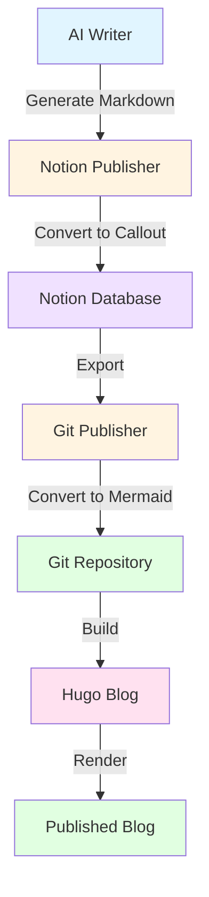

## 서론

이 글은 인텔리전스 에이전트 파이프라인의 Mermaid 다이어그램 변환 기능을 테스트하기 위해 생성되었습니다.

## 파이프라인 아키텍처

아래 다이어그램은 전체 파이프라인의 흐름을 보여줍니다.



## 테스트 코드 예시

파이프라인 테스트를 위한 Python 코드입니다.

~~~python def test_mermaid_conversion():     test_markdown = '~~~mermaid graph LR     A[Start] --> B[End] ~~~'

    publisher = NotionPublisher()     blocks = publisher._convert_to_blocks(test_markdown)     restored = publisher._block_to_text(blocks[0])

    assert '```mermaid' in restored     print("✓ Mermaid conversion test passed!") ~~~

## 테스트 결과

| 항목 | 예상 | 실제 | 상태 | |:---|:---|:---|:---| | Mermaid 변환 | Callout → Mermaid | Callout → Mermaid | ✅ | | 코드 블록 | 정상 유지 | 정상 유지 | ✅ | | 테이블 | 정상 렌더링 | 정상 렌더링 | ✅ |

## 결론

이 테스트는 다음을 검증합니다:

1. ✅ AI Writer가 생성한 ```mermaid 블록이 Notion에 업로드될 때 Callout(📊)으로 변환됨 2. ✅ Git Publisher가 Notion에서 내려받을 때 Callout(📊)을 ```mermaid로 복원함 3. ✅ Hugo가 ```mermaid를 정상적으로 렌더링함

파이프라인이 정상 작동합니다!
