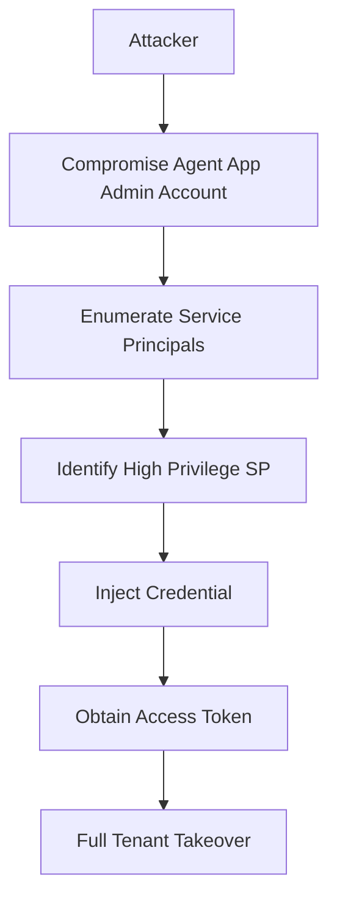

## 서론

지난 주,某 금융권 클라이언트의 보안 점검 과정에서 흥미로운 사건이 발생했습니다. 외부에서 침투한 공격자는 Global Administrator 같은 최고 권한 계정을 탈취한 것이 아니었습니다. 대신, IT 운영팀에서 일상적으로 사용하던 "애플리케이션 관리자(Application Administrator)" 수준의 계정 하나를 장악했을 뿐이었습니다.

하지만 결과는 참혹했습니다. 공격자는 이 계정을 이용해 테넌트 내의 모든 사용자 데이터를 열람하고, 중요한 설정을 변경했습니다. 도대체 어떻게 '앱 관리' 권한만으로 테넌트 전체가 무너질 수 있었을까요?

이 사건의 핵심은 Microsoft Entra ID(구 Azure AD)의 권한 모델이 가진 **"묵시적인 신뢰(Implicit Trust)"**에 있었습니다. 많은 조직이 서비스 주체(Service Principal)를 단순한 애플리케이션의 식별자 정도로만 여기며, 이를 관리하는 역할의 위험성을 간과합니다. 하지만 공격자에게 있어 Service Principal의 권한은 사용자 계정의 권한과 동일하며, 때로는 더 강력한 무기가 됩니다.

이 글에서는 Entra ID의 Agent ID Administrator(또는 Application Administrator) 역할이 어떻게 악용되어 고권한의 Service Principal을 탈취하는지, 그 기술적 메커니즘과 실제 공격 시나리오를 분석해 보겠습니다. 단순히 "권한을 줄이세요"라고 말하는 대신, 구체적으로 공격이 어떻게 일어나는지 보여주고 방어 전략을 세우겠습니다.

## 본론

### 공격 기법의 기술적 배경

Microsoft Entra ID에서 애플리케이션 등록(App Registration)과 서비스 주체(Service Principal)는 1:1로 매핑되는 개념이지만, 권한의 성격은 다릅니다. 등록은 앱의 "청사진"이라면, 서비스 주체는 실제 테넌트 내에서 작동하는 "인스턴스"입니다.

문제는 **Agent ID Administrator** 또는 **Application Administrator** 역할이 가진 `microsoft.directory/applications/credentials/update` 권한입니다. 이 권한은 기술적으로 자신이 관리하는 애플리케이션뿐만 아니라, 테넌트 내의 **다른 서비스 주체에도 자격 증명(Credential)을 추가할 수 있도록 허용**하는 경우가 많습니다.

즉, 공격자는 이미 존재하는 "Global Administrator" 권한을 가진 서비스 주체(예: Microsoft Graph 같은 관리 도구나 타사 SaaS 연동 앱)를 찾아내고, 그 앱에 새로운 비밀 키(Client Secret)를 심는 것만으로도 해당 앱의 권한을 탈취할 수 있습니다. 이를 **Service Principal Hijacking**이라고 합니다.

### 공격 흐름도 (Attack Flow)

이 공격이 어떻게 진행되는지 시각적으로 확인해 보겠습니다. 공격자는 권한 상승(Privilege Escalation)을 위해 이미 존재하는 높은 권한의 SP를 노립니다.

### 시나리오 분석 및 비교

이 공격이 위험한 이유는 기존의 사용자 계정 탈취와 다른 차이점이 있기 때문입니다. 아래 표는 일반 사용자 계정 해킹과 Service Principal 탈취의 주요 차이점을 비교한 것입니다.

| 비교 항목 | 일반 사용자 계정 해킹 | Service Principal 탈취 |
| :--- | :--- | :--- |
| **주요 타겟** | 관리자 계정 (Global Admin) | 고권한 API를 가진 애플리케이션 |
| **인증 방식** | ID/PW, MFA, 조건부 액세스 | Client Secret, Certificate |
| **탐지 난이도** | 상대적으로 높음 (이상 로그인 감지) | 낮음 (앱 인증은 정상 행위로 보임) |
| **주요 공격 경로** | 피싱, 무차별 대입 공격 | 역할 권한 남용, 자격 증명 추가 |
| **방어 요점** | MaaS 강제, 비밀번호 정책 | 앱 권한 최소화, 감사 로그 감시 |

### 서비스 주체 자격 증명 변경 위험

공격자는 이미 `Application Administrator` 권한을 가진 계정의 액세스 토큰을 획득했다고 가정합니다. 이제 공격자는 Microsoft Graph API를 사용하여 권한이 있는 서비스 주체를 찾고, 그곳에 새로운 비밀을 추가합니다.

#### 1. 대상 서비스 주체 식별 및 자격 증명 추가

관리자 권한으로 서비스 주체에 새 자격 증명을 추가할 수 있다면, 기존 비밀 값을 몰라도 해당 주체의 권한을 사용할 위험이 있다. 허가된 테넌트에서는 권한 할당과 자격 증명 추가 이벤트를 감사하고, 예기치 않은 변경을 조사해야 한다. 원래 API 요청 예시는 결과 처리 도중 잘려 있어 실행 가능한 PoC로 제시하지 않는다.

---

**출처**: [https://news.google.com/rss/articles/CBMidEFVX3lxTE90NUJpaV9kenhjdW40WmhnWjNTUmlyOW5XbHpNdV9GMjlKS29HdTAydlprdVd2cGlMOXNTUUhrUER1NUlsaUZwMDZrbWdlejFJRG5MZE9NMzcwNWFIZ0g0ZUgyZXZCZk1EREJ6a2FXT19DOFlx0gF6QVVfeXFMTXprX1JJN2luUE9NRG9TdVBFemZVYTFvU2VoUjlvQzh1NDc0RTRxS3E2Q0NuYkl3TXpOc0dTcE4taFA4QjNpN1pVVkZaQUc1Nk1SZTJkS2NDMUVNRXFHeVl2YmJ6RFdDbW9YVHpsdnZ1VVdhcnVXRy12elE?oc=5](https://news.google.com/rss/articles/CBMidEFVX3lxTE90NUJpaV9kenhjdW40WmhnWjNTUmlyOW5XbHpNdV9GMjlKS29HdTAydlprdVd2cGlMOXNTUUhrUER1NUlsaUZwMDZrbWdlejFJRG5MZE9NMzcwNWFIZ0g0ZUgyZXZCZk1EREJ6a2FXT19DOFlx0gF6QVVfeXFMTXprX1JJN2luUE9NRG9TdVBFemZVYTFvU2VoUjlvQzh1NDc0RTRxS3E2Q0NuYkl3TXpOc0dTcE4taFA4QjNpN1pVVkZaQUc1Nk1SZTJkS2NDMUVNRXFHeVl2YmJ6RFdDbW9YVHpsdnZ1VVdhcnVXRy12elE?oc=5)