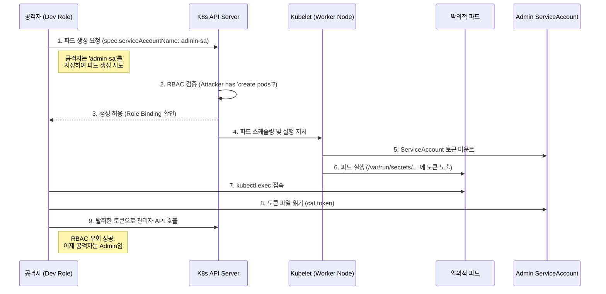

## 서론

금요일 오후 5시 30분, 평소와 다름없이 운영되던 금융권의 쿠버네티스 클러스터에서 사고 알림이 울렸습니다. 평소 개발 파드에만 접근이 가능하던 'dev-a' 계정이, 보안 정책상 철저히 격리되어 있던 'production' 네임스페이스의 데이터베이스 credential을 탈취한 것입니다. 초기 분석 결과, 해당 계정은 관리자 권한이 없었고, 일반적인 파드 조회 및 생성 권한만을 가지고 있었습니다. 하지만 공격자는 이 "제한적인" 권한을 이용해 RBAC(Role-Based Access Control)의 논리적 허점을 파고들었습니다.

이 시나리오는 단순한 상상이 아닙니다. 클라우드 네이티브 환경에서 가장 빈번하게 발생하는 보안 사고 중 하나는 "권한 과잉 부여(Over-privileged)" 혹은 "잘못된 권한 조합"으로 인한 RBAC 우회입니다. 많은 보안 담당자가 "사용자별로 롤(Role)을 분리했다"며 안심하지만, 쿠버네티스의 권한 시스템은 리눅스 파일 시스템의 권한과는 결정적으로 다른 메커니즘을 가집니다. 특히, 파드(Pod)를 생성할 수 있는 권한은 단순히 애플리케이션을 배포하는 것을 넘어, 클러스터 전체의 key를 탈취할 수 있는 '특권'으로 작용할 수 있습니다.

본 글에서는 쿠버네티스 RBAC이 설계된 의도와는 다르게 악용될 수 있는 구체적인 우회 시나리오를 분석하고, 이를 방어하기 위한 실무적인 완화 전략을 다룹니다. 이는 단순한 이론을 넘어, 여러분의 클러스터가 내일 당장 공격받더라도 견딜 수 있도록 만드는 방어 기술입니다.

> **⚠️ 윤리적 경고**: 본문에 포함된 모든 기술적 정보, 공격 벡터, 코드는 보안 연구 및 방어 목적(Defensive Security)입니다. 허가 없는 시스템에서의 테스트는 불법이며, 반드시 격리된 테스트 환경에서만 실험해야 합니다.

## 본론: RBAC 우회 메커니즘 및 공격 시나리오

### 기술적 배경: RBAC와 Service Account의 상관관계

쿠버네티스의 RBAC는 User(또는 Group)와 Permission을 연결하는 역할을 합니다. 하지만 여기서 중요한 점은 **쿠버네티스에는 'User' 리소스가 없다**는 것입니다. 사용자는 외부 인증서나 OIDC 토큰으로 증명되는 추상적 개념입니다. 반면, 클러스터 내부에 실제로 존재하며 권한을 부여받을 수 있는 객체는 바로 **ServiceAccount**입니다.

공격자가 RBAC를 우회하는 핵심 원리는 **"나에게 직접 부여되지 않은 권한을 가진 ServiceAccount를 내 파드에 탑재(Mount)하여 그 정체성을 도용한다"**는 것에 있습니다.

### 공격 시나리오: 파드 생성 권한을 이용한 권한 상승

가장 대표적인 공격 벡터는 **파드 생성 권한(`create pods`)의 악용**입니다. 보통 개발자에게는 배포를 위해 파드 생성 권한을 부여합니다. 하지만 이 권한이 잘못 제어되면, 공격자는 악의적인 파드를 생성하여 시스템 레벨의 권한을 가진 ServiceAccount 토큰을 탈취할 수 있습니다.

아래는 공격자가 제한된 권한으로 관리자 권한을 탈취하는 과정을 시각화한 것입니다.



이 다이어그램에서 볼 수 있듯이, 공격자는 `admin-sa`를 직접 생성하거나 수정할 권한이 없습니다. 단지, **이미 존재하는 권한 있는 ServiceAccount를 자신이 생성하는 파드에 참조(reference)할 수 있는지**가 핵심입니다.

### PoC (Proof of Concept) 코드

다음은 공격자가 권한 상승을 위해 실행하는 악의적인 파드 매니페스트 예시입니다. 이 시나리오에서는 `cluster-admin` 권한을 가진 ServiceAccount가 `kube-system` 네임스페이스에 기본적으로 존재한다고 가정합니다.

```yaml
# malicious-pod.yaml
apiVersion: v1
kind: Pod
metadata:
  name: rce-bypass-pod
  namespace: default # 공격자가 접근 가능한 네임스페이스
spec:
  # 핵심: 관리자 권한을 가진 ServiceAccount를 명시적으로 지정
  serviceAccountName: cluster-admin 
  # 혹은 해당 네임스페이스에 존재하는 high-privilege SA 지정
  
  automountServiceAccountToken: true # 기본값 true, 토큰 마운트 활성화
  
  containers:
  - name: attack-container
    image: alpine:latest
    command: ["/bin/sh", "-c", "--"]
    args: |
      while true; do sleep 30; done;
    # 공격자는 이 파드 내부에서 토큰을 탈취함
    volumeMounts:
    - name: kube-api-access
      mountPath: /var/run/secrets/kubernetes.io/serviceaccount
      readOnly: true
  volumes:
  - name: kube-api-access
    projected:
      sources:
      - serviceAccountToken:
          path: token
          expirationSeconds: 3607
      - configMap:
          name: kube-root-ca.crt
          items:
          - key: ca.crt
            path: ca.crt
      - downwardAPI:
          items:
          - path: namespace
            fieldRef:
              fieldPath: metadata.namespace
```

**공격자의 익스플로잇 단계:**

1.  **준비**: 공격자는 위 YAML 파일을 작성합니다. 2.  **실행**: `kubectl apply -f malicious-pod.yaml` 명령어를 실행합니다. 공격자 계정에는 `create pods` 권한만 있으므로 API 서버는 이 요청을 승인합니다. 3.  **침투**: 파드가 실행되면 쿠버네티스는 자동으로 `serviceAccountName`으로 지정된 `cluster-admin`의 토큰을 파드 내부 `/var/run/secrets/kubernetes.io/serviceaccount/token`에 마운트합니다. 4.  **탈취**: 공격자는 `kubectl exec -it rce-bypass-pod -- sh`로 접속하여 토큰 값을 읽어냅니다. 5.  **권한 남용**: 이 토큰을 `.kube/config` 파일이나 환경 변수에 설정하여, 이제 `cluster-admin` 권한으로 클러스터의 모든 시크릿(Secrets)을 읽거나 마스터 노드를 장악할 수 있습니다.

### 위험도 분석: 권한 조합 비교

모든 `create pods` 권한이 위험한 것은 아닙니다. 문제는 **어떤 ServiceAccount와 결합되어 있느냐**입니다. 아래 표는 권한 조합에 따른 위험도를 분석한 것입니다.

| 권한 유형 | 허용된 동작 | 결합된 ServiceAccount | 위험도 | 이유 | :--- | :--- | :--- | :--- | :--- 
| **Safe** | `pods create` | `default` (별도 권한 없음) | 낮음 (Low) | 파드를 생성하더라도 해당 SA가 아무런 권한이 없으면 클러스터 리소스를 탈취할 수 없음 
| **Medium** | `pods create`, `pods exec` | `default` | 중간 (Medium) | 공격자가 파드 내부로 진입할 수 있으나, 클러스터 API는 호출 불가능. 컨테이너 escape 시도 가능 
| **Critical** | `pods create` | `admin` 또는 `cluster-admin` | **치명적 (Critical)** | **본 취약점 시나리오.** 파드 생성 즉시 관리자 토큰 획득 가능. RBAC 완전 우회 
| **High** | `deployments create` | *Any* | 높음 (High) | Deployment는 ReplicaSet을 생성하고, 이는 다시 Pod를 생성하므로 권한 상승 체인이 이어짐 |

## 방어 가이드: 완화 및 대응 전략

### 1. 즉시 조치 (Immediate Action)

RBAC 우회 취약점을 방어하기 위한 가장 확실하고 즉각적인 조치는 **파드 생성 시 ServiceAccount 토큰의 자동 마운트를 차단**하는 것입니다.

**Step 1: 네임스페이스 레벨에서 자동 마운트 차단** 기본적으로 K8s는 파드 생성 시 ServiceAccount 토큰을 자동으로 주입합니다. 이를 네임스페이스 단위에서 강제로 끌 수 있습니다.

```yaml
# namespace-block-mount.yaml
apiVersion: v1
kind: Namespace
metadata:
  name: secure-production
  annotations:
    # 이 네임스페이스의 모든 파드는 기본적으로 SA 토큰을 마운트하지 않음
    "kubernetes.io/enforce-mountable-secrets": "true"
```

> **주의**: 이 설정 시, 애플리케이션이 K8s API(Ingress controller 등)를 호출해야 한다면 명시적으로 `automountServiceAccountToken: true`를 지정한 파드를 생성해야 합니다.

**Step 2: Immutable 및 Minimizing Role Binding** 가장 강력한 ServiceAccount(`cluster-admin` 등)가 일반 사용자 계정이나 낮은 권한의 파드에서 참조되지 않도록 해야 합니다. `SubjectAccessReview` API를 사용하여 특정 사용자가 특정 ServiceAccount를 사용할 수 있는지 사전에 검증하는 어드미션 컨트롤러(Admission Controller, e.g., Kyverno, OPA Gatekeeper)를 배포하세요.

### 2. 장기 대책 (Long-term Strategy)

**Pod Security Standards (PSS) 적용** Kubernetes 1.25 이상에서는 Pod Security Policy가 deprecated 되었습니다. 대신 **Pod Security Standards**를 네임스페이스 레이블로 적용하여 파드의 보안 수준을 강제해야 합니다.

```bash
# 'restricted' 프로파일 적용 (Privileged 파드, root 사용 등 차단)
kubectl label --overwrite ns production pod-security.kubernetes.io/enforce=restricted
```

**네임스페이스 격리 강화** 개발 환경과 운영 환경의 ServiceAccount를 철저히 분리해야 합니다. 네임스페이스 간의 리소스 참조를 제한하는 NetworkPolicy와 함께, RBAC 네임스페이스 범위를 단일 네임스페이스로 제한(RoleBinding 사용, ClusterRoleBinding 금지)하는 것이 원칙입니다.

### 3. 감지 (Detection)

RBAC 우회 공격은 보통 비정상적인 파드 생성 패턴을 보입니다. 1.  **Audit Log 모니터링**: Audit Log에서 `user.username`이 일반 사용자인데, `objectRef.resource`가 `pods`이고, `requestObject.spec.serviceAccountName`이 고권한 SA(예: `system:serviceaccount:kube-system:cluster-admin`)인 경우를 탐지하세요. 2.  **SIEM 룰 예시**:     *   Condition: `verb:create` AND `resource:pods` AND `serviceAccountName` contains `admin`     *   Action: Alert Security Team

## 결론

쿠버네티스의 RBAC는 매우 강력하지만, "권한의 분리"라는 원칙이 "리소스 간의 참조 관계"까지 통제하지 못할 때 무너집니다. 우리는 흔히 최소 권한 원칙(Principle of Least Privilege)을 이야기할 때, 사용자에게 직접 부여된 권한만을 생각하기 쉽습니다. 하지만 쿠버네티스 환경에서는 **"해당 사용자가 생성할 수 있는 파드가 어떤 ServiceAccount를 가장(Personation)할 수 있는가?"**까지를 권한의 범위로 간주해야 합니다.

결국 보안의 핵심은 **불신(Zero Trust)**에 있습니다. 개발자에게 주어진 `pods create` 권한조차도, 클러스터의 루트 키에 접근할 수 있는 통로가 될 수 있다는 가정 하에 방어 전략을 수립해야 합니다. ServiceAccount 토큰의 자동 마운트를 차단하고, 네임스페이스별로 격리 정책을 엄격히 적용하는 것만이 RBAC 우회 취약점을 근본적으로 차단하는 길입니다.

## 참고자료

- [Kubernetes Documentation: Managing Service Accounts](https://kubernetes.io/docs/concepts/security/service-accounts/)

- [Kubernetes Documentation: Using RBAC Authorization](https://kubernetes.io/docs/reference/access-authn-authz/rbac/)

- [CIS Kubernetes Benchmark (Center for Internet Security)](https://www.cisecurity.org/benchmark/kubernetes)

- [Pod Security Standards](https://kubernetes.io/docs/concepts/security/pod-security-standards/)
