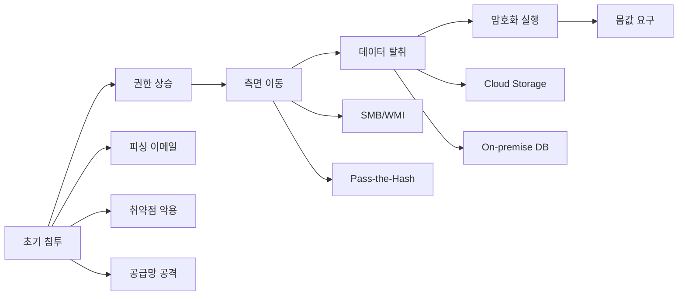
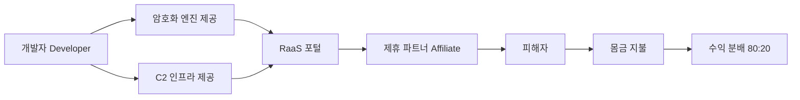

## 서론

2024년 1월, 한 중견 제조기업의 CISO(최고정보보안책임자)는 새벽 2시에 긴급 전화를 받았습니다. "모든 생산 라인이 멈췄습니다. 화면에 비트코인 지급 요구 메시지가 떠 있습니다." 48시간 내에 250만 달러를 지불하지 않으면 모든 설계 도면과 고객 데이터가 공개된다는 협박이었습니다. 이 기업은 결국 3주간의 생산 중단으로 인해 약 4,500만 달러의 손실을 기록했습니다. 몸값은 지불하지 않았지만, 그 대가는 혹독했습니다.

이것은 드문 사례가 아닙니다. Cybercrime Magazine의 최신 예측에 따르면, 전 세계 랜섬웨어 피해 비용은 2031년까지 **2,750억 달러**를 초과할 것으로 전망됩니다. 이는 2024년 약 400억 달러에서 연평균 31%의 성장률을 보이는 수치입니다. 단순히 물가 상승이나 공격 빈도 증가만으로는 설명할 수 없는 폭발적 성장입니다.

핵심은 랜섬웨어 자체의 **진화**입니다. 오늘날의 랜섬웨어는 단순한 암호화 악성코드가 아닙니다. AI를 활용한 표적 탐지, 자동화된 측면 이동, Double Extortion(이중 협박), RaaS(Ransomware-as-a-Service) 모델까지, 하나의 정교한 비즈니스 생태계로 진화했습니다. 이 글에서는 이러한 랜섬웨어의 기술적 진화를 분석하고, 특히 **AI/ML 기반 탐지 및 방어 체계**를 중심으로 실무적인 대응 전략을 제시합니다.

---

## 랜섬웨어 위협의 기술적 진화

### 공격 기법의 고도화: 4세대 랜섬웨어

랜섬웨어는 기술적 관점에서 명확한 세대 구분이 가능합니다. 각 세대는 암호화 기법, 전파 방식, 그리고 수익 모델에서 현저한 차이를 보입니다.

| 세대 | 시기 | 특징 | 대표 사례 | 기술적 난이도 |
| :--- | :--- | :--- | :--- | :--- |
| 1세대 | 1989-2009 | 단순 대칭키 암호화, 이메일 첨부 | AIDS Trojan | 낮음 |
| 2세대 | 2010-2015 | 비대칭키(RSA), C2 서버 통신 | CryptoLocker | 중간 |
| 3세대 | 2016-2019 | 측면 이동,worm 전파, 파일리스 | WannaCry, NotPetya | 높음 |
| 4세대 | 2020-현재 | Double Extortion, RaaS, AI 활용 | Conti, LockBit 3.0 | 매우 높음 |

4세대 랜섬웨어의 결정적 차이는 **Double Extortion** 전략입니다. 기존에는 파일 암호화가 유일한 협박 수단이었으나, 현대 랜섬웨어는 데이터 탈취와 암호화를 동시에 수행합니다. 백업에서 복구하더라도 탈취된 데이터 공갈 위협은 여전히 존재합니다.

### 현대 랜섬웨어 공격 체인

이 공격 체인에서 특히 주목할 것은 **D(데이터 탈취)** 단계의 고도화입니다. 공격자는 정상적인 백업 트래픽과 유사한 패턴으로 데이터를 유출시켜 DLP(Data Loss Prevention) 시스템을 우회합니다. 평균적으로 랜섬웨어 공격은 초기 침투 후 **21일~6개월** 동안 네트워크 내부에서 정찰 활동을 수행합니다. 이 기간을 우리는 **Dwell Time**이라 부르며, 이 시간을 단축하는 것이 방어의 핵심입니다.

### RaaS(Ransomware-as-a-Service): 사이버 범죄의 민주화

2031년 2,750억 달러 예측의 핵심 요인 중 하나는 RaaS 모델의 확산입니다. RaaS는 랜섬웨어 개발자와 운영자를 분리한 프랜차이즈 모델입니다:

이 모델의 위험성은 **진입 장벽의 하락**입니다. 높은 기술력 없이도 누구나 제휴 파트너로 가입해 정교한 랜섬웨어를 배포할 수 있습니다. LockBit와 같은 주요 RaaS 그룹은 친절한 고객 지원, 상세한 매뉴얼, 심지어 보장금 제도까지 제공합니다. 이는 사이버 범죄의 **산업화**를 의미합니다.

---

## AI/ML 기반 랜섬웨어 탐지: 기술적 접근

### 전통적 탐지의 한계와 ML의 필요성

시그니처 기반 안티바이러스는 0-day 랜섬웨어에 무력합니다. 행위 기반 탐지(Heuristic Detection)는 오탐(False Positive) 문제가 심각합니다. 현대 엔터프라이즈 환경에서는 매일 수백만 개의 파일 이벤트가 발생하며, 이를 실시간으로 분석하기 위해서는 ML이 필수적입니다.

### 랜섬웨어 탐지를 위한 특징(Feature) 엔지니어링

랜섬웨어 탐지 모델의 핵심은 효과적인 특징 추출입니다. 주요 특징 그룹은 다음과 같습니다:

방어 분석에서는 다음을 **후보 특징**으로 검토할 수 있습니다.

- 파일 작업 빈도와 쓰기/읽기 비율, 짧은 시간에 연속 발생하는 수정·삭제 이벤트
- 파일명·확장자 변경과 삭제 비율, 접근한 디렉터리 수와 파일 유형의 다양성
- 파일 내용 엔트로피의 평균·분산 변화와 백업 삭제·섀도 복사본 접근 이벤트
- 업무 시간대 대비 작업 시각의 이상 여부(이벤트 타임스탬프와 기준 시간대를 먼저 정의해야 함)

개별 특징만으로 랜섬웨어를 확정할 수 없으며 정상적인 백업·배포·대량 파일 작업과 구별하도록 환경별로 검증해야 합니다. 원래 특징 추출기는 마지막 계산 함수 도중 잘려 있어 실행 가능한 탐지 모델로 제시하지 않습니다.

---

**출처**: [https://news.google.com/rss/articles/CBMirAFBVV95cUxORmdxRU5xbFQ5bVFZTEpudC1RRmNLSzhnNzc3VDJHa3pfOHBMWkhVU25TRVVGcDJBbE5NME1lcUUwLV83cVJvTi05WTdyNUp6b29fMlJRT09LazJ1TXFYQ3hRRDRsNGJwY25rVi1QQWNzQTlrb080RF9lMmJoSjRmLVBTcFc4YVdNRVF0NWM1anZacmQwck9DbzdFbEI3TmRKdlZmbmIxenM4cU01?oc=5](https://news.google.com/rss/articles/CBMirAFBVV95cUxORmdxRU5xbFQ5bVFZTEpudC1RRmNLSzhnNzc3VDJHa3pfOHBMWkhVU25TRVVGcDJBbE5NME1lcUUwLV83cVJvTi05WTdyNUp6b29fMlJRT09LazJ1TXFYQ3hRRDRsNGJwY25rVi1QQWNzQTlrb080RF9lMmJoSjRmLVBTcFc4YVdNRVF0NWM1anZacmQwck9DbzdFbEI3TmRKdlZmbmIxenM4cU01?oc=5)