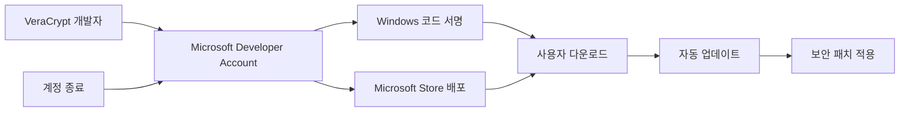
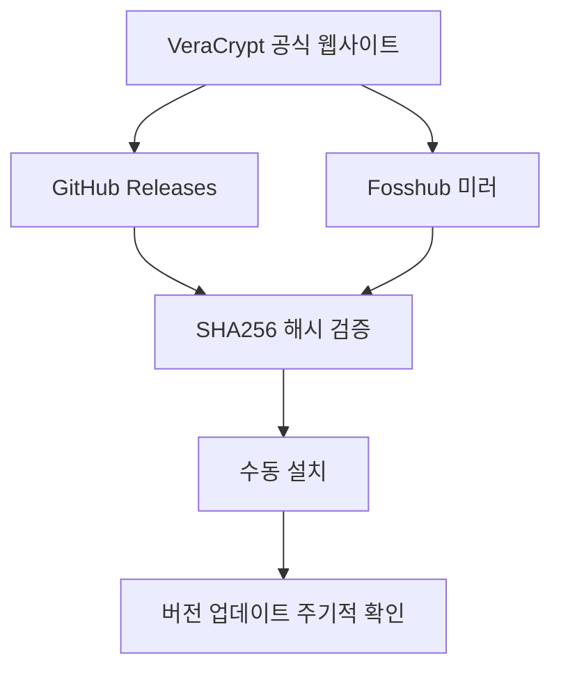
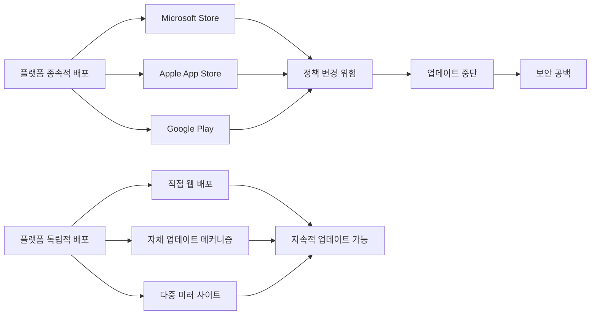

## 서론

어느 날 아침, 기업 보안팀에 긴급 메일 하나가 도착했습니다. "VeraCrypt Windows 업데이트가 멈췄습니다." 엔드포인트 보안 담당자는 패닉에 빠졌고, CISO는 즉각 대책 회의를 소집했습니다. 전 세계 수백만 사용자가 의존하는 오픈소스 디스크 암호화 도구가 하루아침에 업데이트 불능 상태에 빠진 것입니다.

2025년 6월, Microsoft가 VeraCrypt 개발자의 계정을 사전 경고 없이 종료시키면서 Windows 사용자를 위한 업데이트 배포가 중단되었습니다. 이 사건은 단순한 계정 정지를 넘어 심각한 공급망 보안 문제를 드러냅니다.

## 본론

### 사건 개요와 기술적 배경

VeraCrypt는 TrueCrypt의 후속 프로젝트로, AES-256, Serpent, Twofish 등 강력한 암호화 알고리즘을 사용하여 디스크 파티션 또는 가상 디스크 이미지를 암호화하는 오픈소스 도구입니다. 하드웨어 월렛, 기밀 문서 보관, 노트북 전체 디스크 암호화 등 다양한 보안 시나리오에서 필수적으로 사용됩니다.



Microsoft 계정이 종료되면 위 흐름이 중단됩니다. 특히 Windows 환경에서는 코드 서명이 중요한데, 서명되지 않은 바이너리는 SmartScreen에 의해 차단되거나 사용자에게 경고가 표시됩니다.

### 공격 시나리오: 업데이트 단절의 위험성

**⚠️ 주의: 이 섹션은 방어적 관점에서 잠재적 위험을 분석하기 위해 작성되었습니다.**

업데이트가 중단된 상황에서 공격자가 노릴 수 있는 벡터를 분석해봅시다.

설치 버전은 운영체제의 소프트웨어 인벤토리에서 확인하고, 보안 상태는 확인된 제품 공지 및 패치 내역과 대조해야 한다. 원래 예시는 실재하지 않는 CVE 식별자와 문자열 버전 비교만으로 취약·안전 여부를 단정하므로 스캐너로 제시하지 않는다.

### 종속성 위험 비교 분석

| 위험 요소 | Before (계정 정상) | After (계정 종료) | 위험도 |
| :--- | :--- | :--- | :--- |
| 코드 서명 | EV 인증서로 서명 | 서명 불가 | CRITICAL |
| 자동 업데이트 | Microsoft Store 통해 배포 | 배포 중단 | HIGH |
| 취약점 패치 | 정기 업데이트 | 수동 확인 필요 | HIGH |
| 사용자 신뢰 | 공식 채널 검증 | 타사 다운로드 위험 | CRITICAL |
| 드라이버 서명 | WHQL 인증 | 만료 시 갱신 불가 | MEDIUM |

### Step-by-Step 대응 가이드

#### 1단계: 현재 상황 파악

```bash
# Windows PowerShell에서 VeraCrypt 설치 및 버전 확인
Get-ItemProperty "HKLM:\SOFTWARE\Microsoft\Windows\CurrentVersion\Uninstall\*" |
    Where-Object { $_.DisplayName -like "*VeraCrypt*" } |
    Select-Object DisplayName, DisplayVersion, InstallDate

# VeraCrypt 프로세스 확인
Get-Process -Name "VeraCrypt*" -ErrorAction SilentlyContinue
```

#### 2단계: 대체 배포 채널 확인



#### 3단계: 무결성 검증 스크립트

```python
# VeraCrypt 다운로드 무결성 검증 (방어용)
import hashlib
import urllib.request

def verify_veracrypt_integrity(file_path, expected_hash):
    """다운로드한 VeraCrypt 설치파일의 무결성 검증"""
    sha256_hash = hashlib.sha256()
    
    with open(file_path, "rb") as f:
        for chunk in iter(lambda: f.read(4096), b""):
            sha256_hash.update(chunk)
    
    actual_hash = sha256_hash.hexdigest()
    
    if actual_hash == expected_hash:
        print("[OK] 무결성 검증 통과")
        return True
    else:
        print(f"[FAIL] 해시 불일치!")
        print(f"  예상: {expected_hash}")
        print(f"  실제: {actual_hash}")
        return False

# 공식 GitHub Release에서 해시값 확인 후 사용
# https://github.com/veracrypt/VeraCrypt/releases
EXPECTED_HASH = "여기에_공식_SHA256_해시_입력"
verify_veracrypt_integrity("VeraCrypt_Setup.exe", EXPECTED_HASH)
```

#### 4단계: 엔터프라이즈 환경 대응

기업 환경에서는 다음과 같은 조치가 필요합니다:

1. **긴급 인벤토리 조사**: 모든 엔드포인트에서 VeraCrypt 설치 및 버전 확인
2. **대안 검토**: BitLocker, LUKS 등 OS 내장 암호화로 전환 평가
3. **정기 수동 점검**: GitHub Release 페이지 모니터링 자동화

기업 환경에서는 승인된 자산 관리 도구로 VeraCrypt 설치 여부와 버전을 수집한다. 원격 점검을 사용할 경우 SSH 호스트 키 검증을 유지하고 비밀 키·자격 증명은 안전하게 관리한다. 원래 예시의 자동 호스트 키 신뢰와 가상의 엔드포인트 목록은 그대로 실행할 운영 절차가 아니다.

### 근본 원인 분석: 플랫폼 종속성의 위험

이 사건이 시사하는 바는 명확합니다. 보안 도구가 특정 플랫폼의 정책에 종속될 때, 그 도구의 신뢰성 자체가 플랫폼 정책에 의해 좌우됩니다.



VeraCrypt는 이제 GitHub Releases를 통한 직접 배포로 전환할 가능성이 높습니다. 하지만 이 과정에서 사용자들이 타사 사이트에서 악성 버전을 다운로드하는 supply chain attack 위험이 증가합니다.

## 결론

### 핵심 요약
- Microsoft의 갑작스러운 계정 종료로 VeraCrypt Windows 업데이트가 중단됨
- 코드 서명 및 WHQL 인증 불가로 인해 사용자 보안이 위협받음
- 수동 다운로드 후 반드시 SHA256 해시 검증 필수
- 기업 환경은 BitLocker 등 대안 검토 필요

### 전문가 인사이트

이 사건은 단순한 계정 문제가 아닙니다. **보안 인프라의 단일 실패 지점(Single Point of Failure)** 문제를 보여줍니다. 보안 도구는 신뢰할 수 있는 배포 채널을 다중화해야 하며, 특정 벤더의 정책에 종속되어서는 안 됩니다.

오픈소스 보안 프로젝트는 자체 업데이트 인프라를 구축하고, 다중 코드 서명 인증서를 확보하며, 플랫폼 독립적인 배포 체계를 유지해야 합니다. 사용자 역시 공급망 공격에 대비하여 무결성 검증을 습관화해야 합니다.

### 참고 자료
- [VeraCrypt 공식 웹사이트](https://www.veracrypt.fr/)
- [VeraCrypt GitHub Repository](https://github.com/veracrypt/VeraCrypt)
- [404 Media 원본 기사](https://www.404media.co/microsoft-abruptly-terminates-veracrypt-account-halting-windows-updates/)
- [NIST Supply Chain Risk Management](https://csrc.nist.gov/topics/security-supply-chain-risk-management)

---

**출처**: [https://www.404media.co/microsoft-abruptly-terminates-veracrypt-account-halting-windows-updates/](https://www.404media.co/microsoft-abruptly-terminates-veracrypt-account-halting-windows-updates/)