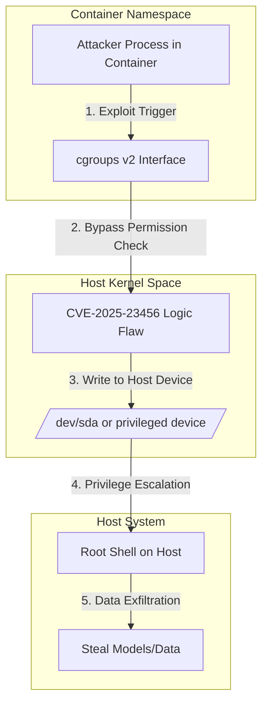

## 서론: AI 인프라의 심장부를 위협하는 보안 구멍

대규모 언어 모델(LLM)을 학습시키거나 추론 서비스를 운영하는 MLOps 엔지니어에게 컨테이너 기술은 선택이 아닌 필수 생태계입니다. 쿠버네티스 클러스터 위에서 수천 개의 GPU 파드(Pod)가 돌아가는 상황을 상상해 봅시다. 만약 사용자가 제공한 악성 추론 스크립트가 단순히 컨테이너 내부의 파일을 삭제하는 것에 그치지 않고, 호스트 시스템의 커널 권한을 탈취해 다른 파드의 학습 데이터를 유출하거나 모델 가중치를 변조한다면 어떨까요?

이것은 단순한 가상 시나리오가 아닙니다. 최근 Linux 커널의 핵심 자원 관리子系统인 cgroups v2에서 발견된 **CVE-2025-23456** 취약점은 이러한 악몽을 현실로 만들 수 있습니다. cgroups v2는 최신 컨테이너 환경의 표준 자원 격리 계층으로, CPU, 메모리, 디바이스 접근을 제어합니다. 이 취약점은 공격자가 컨테이너 격리 경계를 넘어 호스트 시스템으로 탈출(Escape)할 수 있는 결함을 포함하고 있습니다. 특히 GPU와 같은 고가의 하드웨어 자원을 공유하는 AI 연구 환경에서는 이러한 커널 레벨의 보안 구멍이 치명적입니다. 본 글에서는 cgroups v2의 동작 원리를 분석하고, CVE-2025-23456이 어떤 메커니즘을 통해 격리를 무력화하는지 기술적으로 심층 분석하겠습니다.

## 본론: cgroups v2와 탈출 공격의 메커니즘

### cgroups v2의 아키텍처와 보안 모델

cgroups(Control Groups)는 프로세스 그룹의 자원 사용을 제한하고 우선순위를 부여하는 Linux 커널 기능입니다. 기존 cgroups v1이 각 자원(CPU, 메모리 등)마다 독립적인 계층 구조(Mount)를 가진 반면, cgroups v2는 **단일 계층 구조(Unified Hierarchy)**를 채택했습니다. 이는 관리의 복잡성을 줄이고 자원 제어의 일관성을 보장하지만, 모든 컨트롤러가 하나의 트리 구조에 의존하기 때문에 특정 노드의 잘못된 권한 설정이 전체 시스템으로 파급될 위험이 있습니다.

CVE-2025-23456는 cgroups v2의 장치 관리자(Device Controller)와 코어 계층 간의 레이스 컨디션(Race Condition) 또는 권한 검증 로직의 결함을 악용합니다. 공격자는 권한이 없는 컨테이너 내에서도 cgroups v2의 특정 인터페이스를 조작하여 호스트의 디바이스 파일에 접근하거나, 이를 통해 임의의 커널 코드를 실행할 수 있습니다.

### 공격 시나리오 다이어그램

아래 다이어그램은 공격자가 컨테이너 내에서 취약점을 트리거하여 호스트 시스템의 권한을 얻어내는 과정을 시각화한 것입니다.



### 취약점 분석 및 원인

CVE-2025-23456의 핵심은 cgroups v2의 `cgroup.procs` 또는 디바이스.allow 파일 조작 시 발생하는 **검증 우회(Bypass)**입니다. 일반적으로 컨테이너 런타임(Docker, containerd)은 컨테이너 생성 시 해당 cgroup 트리에 대한 접근 권한을 엄격히 제한합니다. 그러나 이 취약점은 파일 디스크립터(File Descriptor)의 수명 주기와 cgroup의 수명 주기가 일치하지 않는 틈을 노립니다.

공격자는 다음과 같은 단계를 거쳐 공격을 수행합니다: 1.  **프로브**: 컨테이너 내에서 현재 cgroups v2 마운트 포인트와 권한을 탐색합니다. 2.  **FD 유지**: 부모 cgroup 또는 시스템 전역 cgroup에 대한 쓰기 권한이 있는 파일 디스크립터를 오픈하여 유지합니다 (특정 상황하에서 가능). 3.  **악의적 쓰기**: 유지된 FD를 통해 자신이 속한 cgroup을 상위 그룹으로 이동시키거나, 장치 접근 제어 규칙을 수정하여 호스트의 디스크 장치 접근을 허용합니다.

### 취약점 진단 스크립트 (Python)

연구자이자 엔지니어로서 시스템이 취약한지 확인하는 것은 매우 중요합니다. 다음은 Python으로 작성된 간단한 진단 스크립트입니다. 이 스크립트는 현재 커널 버전과 cgroups v2 설정을 확인하여 잠재적 위험도를 평가합니다.

```python
import os
import subprocess
import re

def check_kernel_version():
    try:
        result = subprocess.run(['uname', '-r'], capture_output=True, text=True)
        version = result.stdout.strip()
        # CVE-2025-23456 affects specific kernel versions
        # This is a simplified check for demonstration
        print(f"[+] Current Kernel Version: {version}")
        return version
    except Exception as e:
        print(f"[-] Error checking kernel version: {e}")
        return None

def check_cgroups_v2():
    if not os.path.exists('/sys/fs/cgroup'):
        print("[-] cgroups v2 mount point not found.")
        return False
    
    # Check for unified hierarchy (cgroups v2)
    try:
        with open('/proc/mounts', 'r') as f:
            mounts = f.read()
            if 'cgroup2' in mounts:
                print("[+] System is using cgroups v2 (Unified Hierarchy)")
                
                # Check device controller availability
                cgroup_controllers = open('/sys/fs/cgroup/cgroup.controllers').read()
                print(f"[+] Available controllers: {cgroup_controllers.strip()}")
                
                if 'cpu' in cgroup_controllers and 'memory' in cgroup_controllers:
                    print("[!] WARNING: Standard controllers enabled. Check CVE-2025-23456 patches.")
                    return True
            else:
                print("[.] System is using cgroups v1 or hybrid mode.")
                return False
    except Exception as e:
        print(f"[-] Error checking cgroups: {e}")
        return False

def main():
    print("=== CVE-2025-23456 Diagnostic Tool ===")
    ver = check_kernel_version()
    is_v2 = check_cgroups_v2()
    
    if is_v2 and ver:
        print("
[!] Recommendation: Verify kernel patch for CVE-2025-23456 is applied.")
        print("    Run: 'uname -r' and check against your distro's security advisory.")

if __name__ == "__main__":
    main()
```

### cgroups v1 vs v2 보안 비교

cgroups v2로의 전환이 가속화되고 있지만, 보안 관점에서는 새로운 공격 표면이 노출되었습니다. 아래 표는 두 버전의 보안 관점에서의 차이를 비교한 것입니다.

| 특징 | cgroups v1 | cgroups v2 | 보안적 함의 | | :--- | :--- | :--- | :--- | | **계층 구조** | 다중 계층 (각 컨트롤러마다 별도) | 단일 계층 (Unified) | v1은 분리된 구조로 인해 공격 범위가 제한적일 수 있으나 관리가 복잡함. v2는 관리가 쉬우나 설정 오류 시 시스템 전체 영향 | | **디바이스 관리** | devices子系统 (독립적) | 장치 컨트롤러 (통합) | v2의 통합된 관리는 권한 검증 로직이 복잡해져 **CVE-2025-23456**과 같은 로직 결함 유발 가능성 증가 | | **Delegate 허용** | 없음 (일부적 workaround) | 공식 Delegate 기능 지원 | 권한 위임이 명확해졌으나, 위임받은 하위 cgroup이 상위를 조작할 수 있는 취약점(특권 상승)에 취약해질 수 있음 | | **eBPF 통합** | 제한적 | 강력한 통합 | 보안 강화를 위해 eBPF를 활용할 수 있으나, eBPF 자체의 취약점과 결합될 경우 위험도가 상승함 |

### MLOps 관점에서의 대응 방안 (Step-by-Step)

AI 연구자와 운영자는 다음과 같은 단계별 가이드에 따라 시스템을 강화해야 합니다.

1.  **커널 업데이트 (가장 시급)**     *   배포판(CentOS, Ubuntu, Debian 등)의 보안 어드바이저리를 확인하여 CVE-2025-23456이 패치된 커널 버전으로 즉시 업그레이드하십시오. 보통 `sysctl` 설정만으로는 해결되지 않는 커널 레벨의 결함입니다.

2.  **Seccomp 및 AppArmor 프로필 강화**     *   커널 패치 적용 전까지는 컨테이너의 시스템 콜을 엄격히 제한해야 합니다. 특히 `unshare`, `mount`, `clone` 등의 네임스페이스 관련 시스템 콜을 차단하는 Seccomp 프로필을 적용하세요.     *   Docker/K8s 환경에서는 `--security-opt`를 사용하여 강화된 프로필을 로드합니다.

    ```bash     # Example Docker run with restricted profile     docker run --security-opt seccomp=default_profile.json ...     ```

3.  **읽기 전 파일 시스템 고려**     *   학습용 데이터셋이나 모델 서빙 코드는 불변(Immutable)해야 합니다. 컨테이너의 루트 파일 시스템을 읽기 전용으로 마운트하여 공격자가 쉘을 획득하더라도 악성 툴을 다운로드하거나 설정을 변경하지 못하게 합니다.

4.  **네임스페이스 격리 모니터링**     *   eBPF 기반의 보안 도구(예: Falco, Tracee)를 배포하여 cgroups 관련 시스템 콜의 비정상적 패턴을 실시간으로 탐지하십시오.

## 결론: 안전한 AI 연구 환경을 위하여

CVE-2025-23456은 cgroups v2라는 현대적인 커널 기술 내부에 숨어 있던, 그러나 파괴력이 큰 취약점입니다. AI/ML 연구자들은 모델의 정확도나 추론 속도에 집중하기 쉽지만, 이러한 모델들이 구동되는 기반 인프라의 보안이 무너지면 그 결과물은 무의미해질 수 있습니다.

이번 사건을 통해 우리는 **"공유 커널(Shared Kernel)"** 아키텍처가 가진 근본적인 리스크를 재확인했습니다. 커널 패치는 필수적인 첫걸음이지만, 가상 머신(VM) 수준의 격리가 필요한 워크로드(예: 공개된 사용자 코드를 실행하는 AI 허브 등)에는 **gVisor**나 **Kata Containers**와 같은 **Sandboxed Container** 기술을 도입하는 것이 차선책이자 최선의 방어가 될 수 있습니다.

보안은 한 번의 설정으로 끝나는 것이 아니라, 지속적인 모니터링과 최신 위협에 대한 적응 과정입니다. 연구자 여러분의 귀중한 연구 결과가 컨테이너 탈출 공격으로 인해 유출되지 않도록, 오늘 바로 커널 버전을 확인해 보시기를 권장합니다.

### 참고자료

- [Linux Kernel Mailing List: cgroups v2 vulnerability discussion](https://lore.kernel.org/linux-cgroups/)

- [NIST National Vulnerability Database: CVE-2025-23456](https://nvd.nist.gov/vuln/detail/CVE-2025-23456)

- [Red Hat Security Advisory](https://access.redhat.com/security/)

- [Kata Containers Documentation](https://katacontainers.io/docs/)
