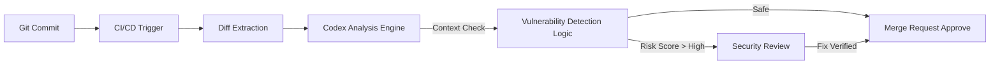

## 서론: 대규모 코드 보안 검토의 과제

새벽 2시, 긴급 보안 알림이 울립니다. 운영 중인 서비스의 주요 모듈에서 원격 코드 실행(RCE) 취약점이 발견되었다는 내용입니다. 개발팀은 당황하며 소스 코드를 뒤집어 보지만, 수천 라인의 로직 속에서 어디가 진짜 보안 구멍인지 찾아내기란 여간 어려운 일이 아닙니다. CI/CD 파이프라인에는 이미 최신 SAST(정적 애플리케이션 보안 테스트) 도구가 설치되어 있었고, 빌드는 성공적으로 완료되었습니다. 그런데도 왜 공격자는 침입에 성공했을까요?
OpenAI는 Codex Security 베타에서 30일 동안 외부 저장소의 커밋 120만 건 이상을 스캔해 치명적 탐지 결과 792건과 고위험 탐지 결과 10,561건을 식별했다고 발표했습니다. 이는 OpenAI의 자체 집계이며, 모든 결과가 서로 다른 확정 취약점이라는 뜻은 아닙니다. 실제 영향과 오탐 여부는 개별 검증이 필요합니다. 이 글에서는 맥락을 고려한 보안 검토 방식과 방어 예시를 살펴봅니다.

## 본론: SAST의 한계와 AI(OpenAI Codex)의 부상


### 기술적 배경: 규칙 기반 분석과 시스템 맥락

SAST 도구는 단순한 문자열 검사에 그치지 않습니다. 데이터 흐름과 호출 관계를 추적하는 도구도 있지만, 프로젝트의 신뢰 경계나 배포 환경을 함께 고려하지 못하면 결과의 우선순위를 매기기 어렵습니다.
Codex Security는 저장소별 위협 모델을 구성해 잠재적 공격 경로를 분석하고, 가능한 경우 격리된 환경에서 탐지 결과를 검증한 뒤 검토할 수정안을 제안합니다. 발표된 건수만으로 기존 SAST 대비 탐지율이나 정확도가 우수하다고 결론지을 수는 없습니다.

### 공격 시나리오: 단순 패턴 매칭이 놓치는 것들

방어 관점에서 이 접근 방식을 이해하려면 공격자의 시각에서 코드를 바라봐야 합니다. 공격자는 단순히 `eval` 함수를 찾는 것이 아니라, 사용자 입력이 해당 함수까지 도달하는 '경로'를 찾습니다.
**⚠️ 윤리적 경고: 아래 예제는 취약점의 원리를 이해하고 방어하기 위한 학습 목적으로 작성되었습니다. 악용 금지입니다.**
#### PoC: 위장한 Command Injection
아래 코드는 정적 분석 도구를 교묘하게 회피하는 Python 코드 예시입니다.

```python
# 취약한 코드 예시 (Vulnerable Code Snippet)
import os

def perform_system_backup(user_input, config):
    # 기존 SAST는 "os.system" 키워드를 감지하지만,
    # 변수의 출처와 검증 로직의 허점을 파악하지 못할 수 있음.
    
    # [허점] 입력값에 대한 화이트리스트 검증이 불완전함
    if ";" in user_input or "&" in user_input:
        return "Invalid characters detected"

    # [악용 가능성] 명령어 결합 연산자(|)는 필터링되지 않음
    # attacker_input: "backup_data | cat /etc/passwd"
    target_dir = config['backup_path']
    command = f"cp {user_input} {target_dir}"
    
    # 실제 시스템 명령 실행
    os.system(command)
    return "Backup started"
```

`os.system`을 호출하는 코드는 기존 SAST에서도 경고할 수 있습니다. 이 예제의 핵심은 `;`와 `&`만 거르는 입력 검사로는 `|` 같은 셸 메타문자를 막지 못한다는 점입니다. 도구의 종류와 무관하게 사용자 입력을 셸 명령문에 연결하지 않는 방식으로 수정해야 합니다.

### 분석 파이프라인 시각화

AI가 코드를 어떻게 스캔하고 취약점을 보고하는지, 그 프로세스를 간단하게 도식화하면 다음과 같습니다.



이 다이어그램은 개발자가 코드를 커밋하면, 시스템이 변경 사항(Diff)을 추출하여 Codex에 전달하고, Codex가 맥락을 분석해 고위험 취약점이 발견되면 보안 팀의 리뷰를 요청하는 흐름을 보여줍니다.

### 기존 도구 vs AI 기반 분석 비교

이러한 AI 기반 접근 방식이 기존 솔루션과 어떻게 다른지 명확히 이해할 필요가 있습니다.
| 비교 항목 | 규칙·데이터 흐름 기반 SAST | Codex Security |
| :--- | :--- | :--- |
| **분석 방식** | 정적 코드 분석 및 사전 정의된 규칙 | 저장소 맥락과 위협 모델을 활용한 분석 |
| **결과 확인** | 도구별 경고와 근거를 검토 | 가능한 경우 격리 환경에서 탐지 결과 검증 |
| **운영 시 유의점** | 규칙과 오탐 관리 필요 | 결과의 실제 영향 및 제안한 패치의 인간 검토 필요 |

### 실무 적용 가이드 및 완화 조치

단순히 AI 도구를 도입한다고 모든 문제가 해결되는 것은 아닙니다. 현장에서는 다음과 같은 하이브리드 접근 방식이 필요합니다.
#### 1. 단계별 도입 전략
1.  **Pre-commit Hook (사전 검증)**: 가벼운 Linting과 간단한 규칙 검사.
2.  **PR Review (Pull Request)**: Codex와 같은 AI를 활용해 변경된 코드의 로직을 깊이 있게 검토.
3.  **Human-in-the-loop (필수)**: AI가 탐지한 취약점은 반드시 보안 전문가의 최종 승인을 거치도록 워크플로우 구성.
#### 2. 완화 조치 코드 예시
앞서 언급한 취약 코드를 안전하게 수정한 예시입니다. 핵심은 사용자 입력을 직접 명령어 문자열에 연결하는 것이 아니라, 파라미터화된 방식을 사용하거나 안전한 라이브러리를 활용하는 것입니다.

```python
# 안전한 코드 예시 (Secure Code Snippet)
import shutil
import os

def perform_system_backup_safe(user_input, config):
    # [완화 조치 1] 화이트리스트 기반 검증 강화
    # 허용된 문자와 길이만 엄격히 제한
    allowed_chars = set("abcdefghijklmnopqrstuvwxyzABCDEFGHIJKLMNOPQRSTUVWXYZ0123456789_-")
    if not (set(user_input) <= allowed_chars) or len(user_input) > 50:
        return "Invalid filename format"

    target_dir = config['backup_path']
    source_path = os.path.join("/var/uploads", user_input)
    dest_path = os.path.join(target_dir, user_input)
    
    try:
        # [완화 조치 2] Shell 실행 대신 Python 내부 함수(shutil) 사용
        # OS 명령어 인젝션 자체가 불가능한 구조
        shutil.copy(source_path, dest_path)
        return "Backup started successfully"
    except Exception as e:
        # 에러 처리 시 사용자 입력을 다시 노출하지 않도록 주의
        return "Backup failed"
```

이 코드에서는 `os.system`을 사용하지 않음으로써 쉘 인젝션 공격 벡터 자체를 원천적으로 차단했습니다. AI 분석 도구는 이러한 '안전한 라이브러리 사용'을 권장하는 방향으로 피드백을 줄 수 있습니다.

## 결론: 하이브리드 보안의 미래

OpenAI가 발표한 120만 커밋 이상의 스캔 결과에는 고위험 탐지 결과 10,561건이 포함됩니다. 이는 확정된 고유 취약점 수나 다른 도구와의 비교 실험 결과가 아닙니다. AI 기반 검토도 오탐과 누락 가능성이 있으므로 실제 영향은 검증해야 합니다.
진정으로 강력한 보안 체계는 **"AI의 빠른 분석 능력 + 인간 전문가의 전략적 판단 + 기존 SAST의 견고한 규칙"**이 결합된 하이브리드 모델에서 나옵니다. 연구 결과는 우리에게 명확한 메시지를 던집니다. 이제 코드를 작성하는 것만큼이나, 코드를 '이해'하고 '감사'하는 능력이 필수적인 시대가 되었습니다.

### 참고자료

- [OpenAI: Codex Security 연구 프리뷰 발표](https://openai.com/index/codex-security-now-in-research-preview/)
